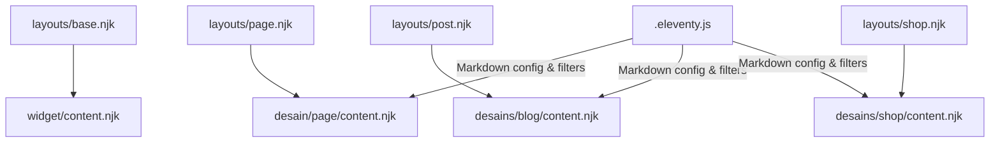
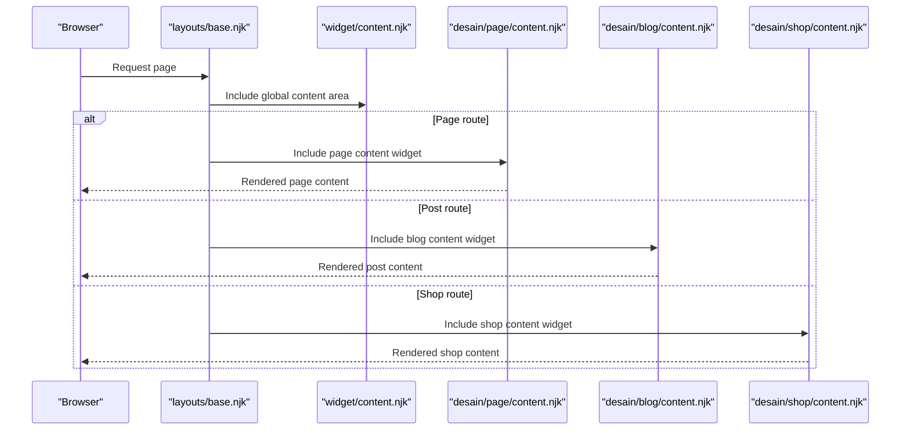
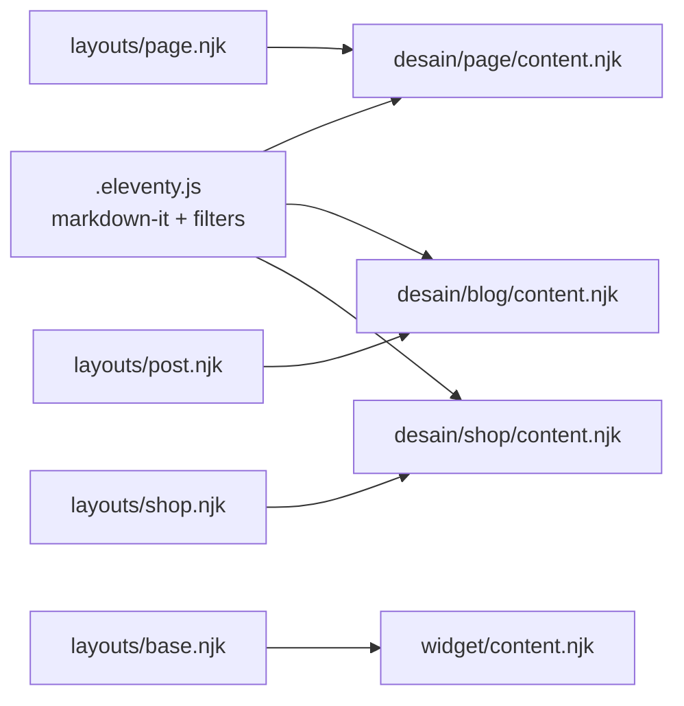

# Content Widget

<cite>
**Referenced Files in This Document**
- [content.njk](file://_includes/widget/content.njk)
- [base.njk](file://_includes/layouts/base.njk)
- [page.njk](file://_includes/layouts/page.njk)
- [post.njk](file://_includes/layouts/post.njk)
- [shop.njk](file://_includes/layouts/shop.njk)
- [content.njk (Page)](file://_includes/desain/page/content.njk)
- [content.njk (Blog)](file://_includes/desain/blog/content.njk)
- [content.njk (Shop)](file://_includes/desain/shop/content.njk)
- [.eleventy.js](file://.eleventy.js)
- [about.md](file://page/about.md)
- [best-gift-ideas-in-uae-2025.md](file://posts/best-gift-ideas-in-uae-2025.md)
</cite>

## Table of Contents
1. Introduction
2. Project Structure
3. Core Components
4. Architecture Overview
5. Detailed Component Analysis
6. Dependency Analysis
7. Performance Considerations
8. Troubleshooting Guide
9. Conclusion

## Introduction
This document explains the content.njk widget component and how it participates in Eleventy’s rendering pipeline to display main content areas across pages, posts, and shop items. It covers markdown processing, dynamic content injection, filtering utilities, image optimization patterns, responsive layout strategies, customization approaches, integration with Eleventy collections, security considerations, performance tips for large content blocks, and accessibility best practices.

## Project Structure
The content system is composed of:
- A global content widget that renders the page body within the base layout.
- Layouts that include domain-specific content widgets for pages, blog posts, and shop items.
- Markdown configuration and filters that influence how content is processed and displayed.

**Diagram sources**
- [base.njk:1-5](file://_includes/layouts/base.njk#L1-L5)
- [content.njk:1-1](file://_includes/widget/content.njk#L1-L1)
- [page.njk:1-5](file://_includes/layouts/page.njk#L1-L5)
- [post.njk:1-6](file://_includes/layouts/post.njk#L1-L6)
- [shop.njk:1-5](file://_includes/layouts/shop.njk#L1-L5)
- [content.njk (Page):1-6](file://_includes/desain/page/content.njk#L1-L6)
- [content.njk (Blog):1-8](file://_includes/desain/blog/content.njk#L1-L8)
- [content.njk (Shop):1-144](file://_includes/desain/shop/content.njk#L1-L144)
- [.eleventy.js:106-116](file://.eleventy.js#L106-L116)

**Section sources**
- [base.njk:1-5](file://_includes/layouts/base.njk#L1-L5)
- [content.njk:1-1](file://_includes/widget/content.njk#L1-L1)
- [page.njk:1-5](file://_includes/layouts/page.njk#L1-L5)
- [post.njk:1-6](file://_includes/layouts/post.njk#L1-L6)
- [shop.njk:1-5](file://_includes/layouts/shop.njk#L1-L5)
- [content.njk (Page):1-6](file://_includes/desain/page/content.njk#L1-L6)
- [content.njk (Blog):1-8](file://_includes/desain/blog/content.njk#L1-L8)
- [content.njk (Shop):1-144](file://_includes/desain/shop/content.njk#L1-L144)
- [.eleventy.js:106-116](file://.eleventy.js#L106-L116)

## Core Components
- Global content widget: Renders the current page’s content variable into the DOM using Nunjucks safe output.
- Domain content widgets:
  - Page content: Displays title, description, optional cover image, and rendered content.
  - Blog content: Composes post and shop sections within a two-column grid.
  - Shop content: Full product detail view including features, price, CTA, tags, gallery, and remaining content.

Key behaviors:
- Content rendering uses safe output to allow HTML from markdown or frontmatter.
- Images are responsive via Bootstrap utility classes and attributes like width/height and lazy loading where applicable.
- Dynamic data fields (title, description, cover, bullet_points, price, amazonLink, tags, images, ecwidId) drive UI composition.

**Section sources**
- [content.njk:1-1](file://_includes/widget/content.njk#L1-L1)
- [content.njk (Page):1-6](file://_includes/desain/page/content.njk#L1-L6)
- [content.njk (Blog):1-8](file://_includes/desain/blog/content.njk#L1-L8)
- [content.njk (Shop):1-144](file://_includes/desain/shop/content.njk#L1-L144)

## Architecture Overview
The rendering flow starts at the base layout, which includes the global content widget. Each page type overrides the body by including its own content widget through a dedicated layout.

**Diagram sources**
- [base.njk:1-5](file://_includes/layouts/base.njk#L1-L5)
- [content.njk:1-1](file://_includes/widget/content.njk#L1-L1)
- [page.njk:1-5](file://_includes/layouts/page.njk#L1-L5)
- [post.njk:1-6](file://_includes/layouts/post.njk#L1-L6)
- [shop.njk:1-5](file://_includes/layouts/shop.njk#L1-L5)
- [content.njk (Page):1-6](file://_includes/desain/page/content.njk#L1-L6)
- [content.njk (Blog):1-8](file://_includes/desain/blog/content.njk#L1-L8)
- [content.njk (Shop):1-144](file://_includes/desain/shop/content.njk#L1-L144)

## Detailed Component Analysis

### Global Content Widget (widget/content.njk)
- Purpose: Provides the main content slot used by the base layout.
- Behavior: Outputs the current page’s content variable safely so HTML generated by markdown or injected by layouts is preserved.

Usage pattern:
- The base layout includes this widget to render the page body.
- Domain-specific layouts replace the body by including their own content widgets.

Security note:
- Safe output allows HTML; ensure upstream content is sanitized or trusted.

**Section sources**
- [content.njk:1-1](file://_includes/widget/content.njk#L1-L1)
- [base.njk:1-5](file://_includes/layouts/base.njk#L1-L5)

### Page Content Widget (desain/page/content.njk)
- Displays page title and description.
- Optionally shows a cover image with responsive styling.
- Renders the page’s markdown content safely.

Responsive behavior:
- Uses Bootstrap container and utility classes for spacing and fluid images.

Accessibility:
- Image alt text is derived from the page title.

**Section sources**
- [content.njk (Page):1-6](file://_includes/desain/page/content.njk#L1-L6)

### Blog Content Widget (desain/blog/content.njk)
- Composes two columns: one for a post list and one for shop highlights.
- Includes sub-components for post listing and shop section.

Integration points:
- Relies on Eleventy collections for posts and other data.

**Section sources**
- [content.njk (Blog):1-8](file://_includes/desain/blog/content.njk#L1-L8)

### Shop Content Widget (desain/shop/content.njk)
- Product detail layout with:
  - Title and description
  - Cover image with responsive sizing and lazy loading
  - Features list from bullet_points
  - Price and call-to-action button linking to Amazon
  - Tags rendered with safe slugs
  - Optional gallery inclusion
  - Remaining content area for rich descriptions
  - Navigation between previous/next items
  - Client-side analytics event on buy button click

Data-driven fields:
- title, description, cover, bullet_points, price, amazonLink, tags, images, ecwidId

Performance:
- Lazy loading on cover image
- Explicit width/height to reduce layout shifts

Accessibility:
- Meaningful alt text on images
- Semantic article structure

Security:
- External link uses rel="noopener"
- Safe slug filter prevents invalid URLs

Analytics:
- Emits events when the buy button is clicked, using available global analytics function.

**Section sources**
- [content.njk (Shop):1-144](file://_includes/desain/shop/content.njk#L1-L144)

### Markdown Processing and Filters (.eleventy.js)
- Markdown-it configured with HTML enabled, line breaks, and linkify.
- Anchor plugin adds permalinks to headings.
- Custom filters:
  - safeSlug: sanitizes strings for URL-safe slugs.
  - filterTagList: excludes internal tags from listings.
  - sanitize: basic string normalization.
  - xmlEncode: encodes characters for XML feeds.
  - head/min: array helpers.

Impact on content:
- Headings get anchor links.
- Links auto-detected and converted.
- Tags and slugs are normalized for consistent navigation.

**Section sources**
- [.eleventy.js:106-116](file://.eleventy.js#L106-L116)
- [.eleventy.js:48-70](file://.eleventy.js#L48-L70)
- [.eleventy.js:72-95](file://.eleventy.js#L72-L95)
- [.eleventy.js:134-143](file://.eleventy.js#L134-L143)

### Data Integration Examples
- Page example: about.md sets layout, title, description, cover, and permalink.
- Post example: best-gift-ideas-in-uae-2025.md demonstrates rich markdown content, embedded images, and inline CTAs.

These files illustrate how frontmatter drives the content widgets’ variables and how markdown content is rendered.

**Section sources**
- [about.md:1-10](file://page/about.md#L1-L10)
- [best-gift-ideas-in-uae-2025.md:1-28](file://posts/best-gift-ideas-in-uae-2025.md#L1-L28)

## Dependency Analysis
The content system depends on:
- Layouts to orchestrate which content widget is included.
- Markdown library configuration to transform source content.
- Collections and filters to compute lists, tags, and slugs.
- Client scripts for search and analytics.

**Diagram sources**
- [.eleventy.js:106-116](file://.eleventy.js#L106-L116)
- [base.njk:1-5](file://_includes/layouts/base.njk#L1-L5)
- [content.njk:1-1](file://_includes/widget/content.njk#L1-L1)
- [page.njk:1-5](file://_includes/layouts/page.njk#L1-L5)
- [post.njk:1-6](file://_includes/layouts/post.njk#L1-L6)
- [shop.njk:1-5](file://_includes/layouts/shop.njk#L1-L5)
- [content.njk (Page):1-6](file://_includes/desain/page/content.njk#L1-L6)
- [content.njk (Blog):1-8](file://_includes/desain/blog/content.njk#L1-L8)
- [content.njk (Shop):1-144](file://_includes/desain/shop/content.njk#L1-L144)

**Section sources**
- [.eleventy.js:106-116](file://.eleventy.js#L106-L116)
- [base.njk:1-5](file://_includes/layouts/base.njk#L1-L5)
- [content.njk:1-1](file://_includes/widget/content.njk#L1-L1)
- [page.njk:1-5](file://_includes/layouts/page.njk#L1-L5)
- [post.njk:1-6](file://_includes/layouts/post.njk#L1-L6)
- [shop.njk:1-5](file://_includes/layouts/shop.njk#L1-L5)
- [content.njk (Page):1-6](file://_includes/desain/page/content.njk#L1-L6)
- [content.njk (Blog):1-8](file://_includes/desain/blog/content.njk#L1-L8)
- [content.njk (Shop):1-144](file://_includes/desain/shop/content.njk#L1-L144)

## Performance Considerations
- Use lazy loading for large images (already applied on shop cover).
- Provide explicit width/height to avoid layout shift.
- Prefer WebP/AVIF formats and serve appropriately sized images.
- Minimize heavy inline styles; leverage CSS classes.
- Defer non-critical scripts and initialize only when needed.
- For very long articles, consider pagination or progressive loading techniques at the client side if necessary.

[No sources needed since this section provides general guidance]

## Troubleshooting Guide
Common issues and resolutions:
- HTML not rendering in content:
  - Ensure markdown is configured to allow HTML and that content is output safely.
- Broken tag links:
  - Verify safeSlug usage and that tags do not contain reserved names filtered out by filterTagList.
- Analytics not firing:
  - Confirm the global analytics function exists before calling it and that the script loads before user interaction.
- Images not optimizing:
  - Check file formats and sizes; ensure srcset or CDN resizing is used if required.

**Section sources**
- [.eleventy.js:106-116](file://.eleventy.js#L106-L116)
- [.eleventy.js:48-70](file://.eleventy.js#L48-L70)
- [.eleventy.js:64-66](file://.eleventy.js#L64-L66)
- [content.njk (Shop):116-143](file://_includes/desain/shop/content.njk#L116-L143)

## Conclusion
The content.njk widget integrates seamlessly with Eleventy’s layout system to render main content areas across different page types. With configurable markdown processing, robust filtering, and responsive design patterns, it supports flexible content authoring while maintaining performance and accessibility. Security is addressed through careful use of safe output and external link handling. Extensions can be added via custom filters, collections, and additional content widgets tailored to new domains.