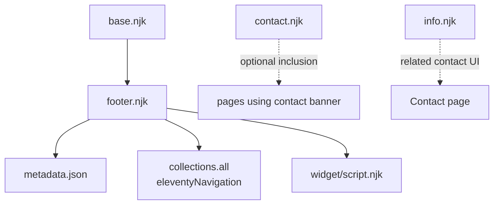
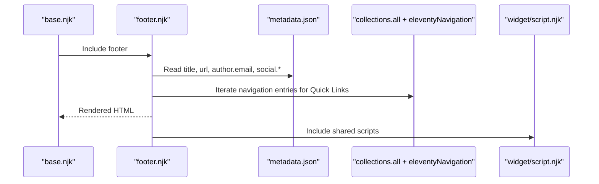
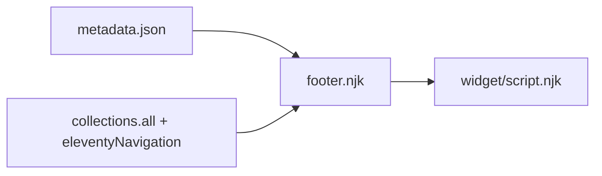

# Footer Widget

<cite>
**Referenced Files in This Document**
- [footer.njk](file://_includes/widget/footer.njk)
- [metadata.json](file://_data/metadata.json)
- [widget.json](file://_data/widget.json)
- [base.njk](file://_includes/layouts/base.njk)
- [contact.njk](file://_includes/widget/contact.njk)
- [info.njk](file://_includes/desain/contact/info.njk)
- [index.css](file://css/index.css)
</cite>

## Table of Contents
1. [Introduction](#introduction)
2. [Project Structure](#project-structure)
3. [Core Components](#core-components)
4. [Architecture Overview](#architecture-overview)
5. [Detailed Component Analysis](#detailed-component-analysis)
6. [Dependency Analysis](#dependency-analysis)
7. [Performance Considerations](#performance-considerations)
8. [Troubleshooting Guide](#troubleshooting-guide)
9. [Conclusion](#conclusion)
10. [Appendices](#appendices)

## Introduction
This document explains the footer widget component used across the site. It covers layout structure, contact information display, social media links integration, and copyright management. It also documents how footer content is dynamically generated from site metadata and configuration files, and provides guidance for customization, responsive design patterns for mobile devices, and accessibility compliance requirements.

## Project Structure
The footer is implemented as a reusable Nunjucks include that is injected into every page via the base layout. The footer reads global site metadata and navigation collections to render dynamic content such as brand title, author email, and quick links.

**Diagram sources**
- [base.njk:1-4](file://_includes/layouts/base.njk#L1-L4)
- [footer.njk:1-100](file://_includes/widget/footer.njk#L1-L100)
- [metadata.json:1-47](file://_data/metadata.json#L1-L47)

**Section sources**
- [base.njk:1-4](file://_includes/layouts/base.njk#L1-L4)
- [footer.njk:1-100](file://_includes/widget/footer.njk#L1-L100)

## Core Components
- Footer template: Renders brand info, quick links, policies, business address, social icons, and copyright.
- Metadata source: Provides site-wide values like title, URL, author email, and social links.
- Navigation source: Uses Eleventy’s navigation collection to build “Quick Links.”
- Optional contact banner: A separate widget can be included on pages to show help/contact prompts.

Key responsibilities:
- Dynamic branding and links from metadata
- Auto-populated quick links from navigation
- Centralized social links and Amazon storefront link
- Copyright year derived from current page date
- Inclusion of shared scripts at the end of the footer

**Section sources**
- [footer.njk:1-100](file://_includes/widget/footer.njk#L1-L100)
- [metadata.json:1-47](file://_data/metadata.json#L1-L47)

## Architecture Overview
The footer integrates with Eleventy data and collections to produce a consistent, data-driven footer across all pages.

**Diagram sources**
- [base.njk:1-4](file://_includes/layouts/base.njk#L1-L4)
- [footer.njk:1-100](file://_includes/widget/footer.njk#L1-L100)
- [metadata.json:1-47](file://_data/metadata.json#L1-L47)

## Detailed Component Analysis

### Footer Template (footer.njk)
Responsibilities:
- Brand section: Displays site title and description; uses metadata for href and text.
- Quick Links: Iterates navigation items to generate a list of links.
- Policies: Static policy links for privacy, terms, shipping, refund, and contact.
- Business Information: Shows business name, location, email, and Amazon storefront link.
- Social Media Icons: Centered row of social icons with accessible labels.
- Bottom Bar: Copyright year based on page date and marketplace messaging.
- Scripts: Includes shared scripts at the end.

Data bindings:
- Brand title and URL from metadata
- Author email from metadata
- Social links from metadata (used in business info)
- Navigation links from collections via eleventyNavigation filter
- Copyright year from page.date

Accessibility highlights:
- External links use target="_blank" with rel="noopener"
- Social icon links include aria-labels for screen readers
- Semantic HTML elements (footer, address, nav-like lists)

Responsive behavior:
- Uses Bootstrap grid classes to stack columns on small screens and align side-by-side on medium+ screens
- Flex utilities center and space social icons consistently

Customization points:
- Add/remove policy links in the Policies section
- Update business info fields in metadata or inline if needed
- Extend social icons by adding new anchor elements with appropriate aria-labels
- Modify copyright text or add additional legal notices in the bottom bar

**Section sources**
- [footer.njk:1-100](file://_includes/widget/footer.njk#L1-L100)

### Metadata Integration (metadata.json)
Provides:
- Site identity: title, description, url, language, locale
- Author details: name, email, url
- Business details: name, type, address, currency, payment methods
- Social profiles: instagram, facebook, tiktok, amazon

Usage in footer:
- Brand title and homepage link
- Author email in business info
- Amazon storefront link in business info and social icons

Extensibility:
- Add new social platforms under social keys and reference them in the footer where appropriate
- Keep email and business address centralized here to avoid duplication

**Section sources**
- [metadata.json:1-47](file://_data/metadata.json#L1-L47)

### Contact Banner Widget (contact.njk)
Purpose:
- Displays a contextual help banner with a call-to-action button linking to the contact page.
- Content is driven by widget.json keys: help, helpinfo, helpbtn, helplink.

Integration:
- Can be included on specific pages or layouts to surface support prompts.

**Section sources**
- [contact.njk:1-8](file://_includes/widget/contact.njk#L1-L8)
- [widget.json:1-7](file://_data/widget.json#L1-L7)

### Related Contact UI (info.njk)
Purpose:
- Renders a full contact page layout with address, email/phone, Amazon storefront, and social links.
- Demonstrates consistent styling and accessibility patterns used elsewhere.

Note:
- Not part of the footer, but shares similar social link patterns and responsive grid usage.

**Section sources**
- [info.njk:1-95](file://_includes/desain/contact/info.njk#L1-L95)

## Dependency Analysis
The footer depends on:
- Global metadata for branding and contact details
- Eleventy navigation collection for dynamic quick links
- Shared script include for common functionality

**Diagram sources**
- [footer.njk:1-100](file://_includes/widget/footer.njk#L1-L100)
- [metadata.json:1-47](file://_data/metadata.json#L1-L47)

**Section sources**
- [footer.njk:1-100](file://_includes/widget/footer.njk#L1-L100)
- [metadata.json:1-47](file://_data/metadata.json#L1-L47)

## Performance Considerations
- The footer includes a shared script file at the end of the page, which helps avoid blocking initial rendering.
- Using static policy links avoids unnecessary lookups.
- Social icons are simple anchors with minimal overhead.
- Avoid heavy DOM manipulation inside the footer; keep it declarative.

[No sources needed since this section provides general guidance]

## Troubleshooting Guide
Common issues and resolutions:
- Missing quick links: Ensure navigation entries exist in your content and are configured for eleventyNavigation. The footer iterates collections.all | eleventyNavigation to build the list.
- Incorrect email or social links: Verify metadata.json contains correct values for author.email and social.* keys.
- Broken external links: Confirm rel="noopener" is present on all target="_blank" links and that URLs are valid.
- Accessibility warnings: Ensure each social icon has an aria-label describing its destination.

**Section sources**
- [footer.njk:1-100](file://_includes/widget/footer.njk#L1-L100)
- [metadata.json:1-47](file://_data/metadata.json#L1-L47)

## Conclusion
The footer widget provides a clean, data-driven, and accessible way to present brand information, navigation, policies, business details, and social links across the site. By centralizing content in metadata and leveraging Eleventy collections, updates propagate automatically. The component follows responsive and accessibility best practices and can be extended with minimal effort.

[No sources needed since this section summarizes without analyzing specific files]

## Appendices

### Customization Examples

- Customize footer sections
  - Update brand and contact details in metadata.json.
  - Edit policy links directly in the footer template.
  - Adjust business information fields in metadata.json.

- Add a new social media platform
  - Add a new key under social in metadata.json.
  - Insert a new anchor element in the social icons section with an appropriate aria-label and rel attributes.

- Implement a contact form
  - Create a dedicated contact page and include the contact banner widget where appropriate.
  - Use the existing contact UI patterns for consistency and accessibility.

- Responsive design patterns for mobile devices
  - Use Bootstrap grid classes to stack content on small screens and align horizontally on larger screens.
  - Maintain adequate touch targets and spacing for social icons.

- Accessibility compliance requirements
  - Provide descriptive aria-labels for icon-only links.
  - Use semantic elements (footer, address, lists).
  - Ensure sufficient color contrast and keyboard navigability.

[No sources needed since this section provides general guidance]