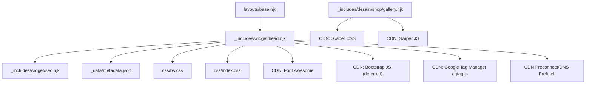
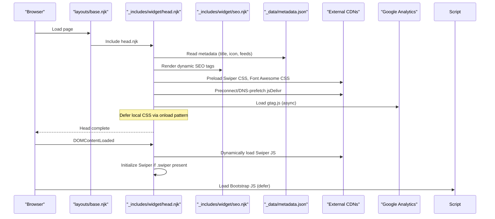
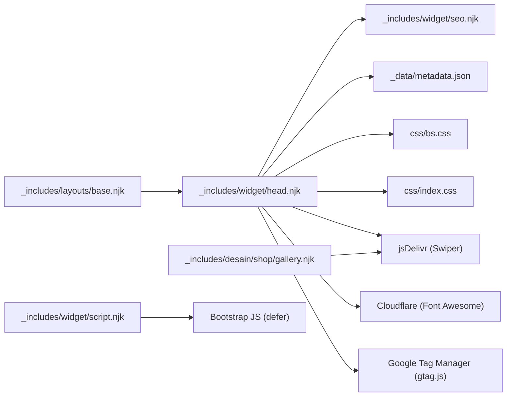

# Head Widget

<cite>
**Referenced Files in This Document**
- [head.njk](file://_includes/widget/head.njk)
- [seo.njk](file://_includes/widget/seo.njk)
- [base.njk](file://_includes/layouts/base.njk)
- [script.njk](file://_includes/widget/script.njk)
- [metadata.json](file://_data/metadata.json)
- [bs.css](file://css/bs.css)
- [gallery.njk](file://_includes/desain/shop/gallery.njk)
</cite>

## Table of Contents
1. [Introduction](#introduction)
2. [Project Structure](#project-structure)
3. [Core Components](#core-components)
4. [Architecture Overview](#architecture-overview)
5. [Detailed Component Analysis](#detailed-component-analysis)
6. [Dependency Analysis](#dependency-analysis)
7. [Performance Considerations](#performance-considerations)
8. [Troubleshooting Guide](#troubleshooting-guide)
9. [Conclusion](#conclusion)
10. [Appendices](#appendices)

## Introduction
This document explains the head.njk widget component that manages the HTML document head for the site. It covers meta tags, CSS preloading, JavaScript optimization, Swiper carousel integration with lazy loading, Font Awesome CDN setup, Bootstrap CSS optimization, Google Analytics configuration, responsive viewport settings, mobile web app capabilities, and favicon management. It also provides guidance on customizing meta tags, adding new CDNs, and optimizing resource loading strategies while addressing performance considerations such as preloading, defer loading, and noscript fallbacks.

## Project Structure
The head is assembled by including the head.njk widget from a layout. The SEO metadata is generated via a separate seo.njk widget. Bootstrap JS is deferred at the end of the document through script.njk. Data used by the head (e.g., title, description, icons, feeds) comes from metadata.json.

**Diagram sources**
- [base.njk:1-5](file://_includes/layouts/base.njk#L1-L5)
- [head.njk:1-113](file://_includes/widget/head.njk#L1-L113)
- [seo.njk:1-254](file://_includes/widget/seo.njk#L1-L254)
- [metadata.json:1-47](file://_data/metadata.json#L1-L47)
- [bs.css:7-12](file://css/bs.css#L7-L12)
- [gallery.njk:1-49](file://_includes/desain/shop/gallery.njk#L1-L49)
- [script.njk:1-3](file://_includes/widget/script.njk#L1-L3)

**Section sources**
- [base.njk:1-5](file://_includes/layouts/base.njk#L1-L5)
- [head.njk:1-113](file://_includes/widget/head.njk#L1-L113)
- [seo.njk:1-254](file://_includes/widget/seo.njk#L1-L254)
- [metadata.json:1-47](file://_data/metadata.json#L1-L47)
- [script.njk:1-3](file://_includes/widget/script.njk#L1-L3)

## Core Components
- head.njk: Defines the <html>, <head>, core meta tags, preload/prefetch directives, CSS and JS loading strategy, favicon, and analytics initialization.
- seo.njk: Generates dynamic title, descriptions, Open Graph, Twitter cards, canonical URL, robots directive, Google verification, and structured data (Schema.org).
- metadata.json: Centralized site-wide metadata (title, description, language, locale, icon, feed paths, author, business info, social links).
- gallery.njk: Uses Swiper carousel markup and native image lazy loading.
- bs.css: Local CSS with font-face and display behavior.
- script.njk: Defers Bootstrap JS to the end of the document.

Key responsibilities:
- Manage critical rendering path via preload and async/defer patterns.
- Provide robust SEO and social sharing metadata.
- Integrate third-party libraries efficiently (Swiper, Font Awesome, Bootstrap JS, Google Analytics).
- Ensure accessibility and mobile readiness (viewport, theme color, PWA hints).

**Section sources**
- [head.njk:1-113](file://_includes/widget/head.njk#L1-L113)
- [seo.njk:1-254](file://_includes/widget/seo.njk#L1-L254)
- [metadata.json:1-47](file://_data/metadata.json#L1-L47)
- [gallery.njk:1-49](file://_includes/desain/shop/gallery.njk#L1-L49)
- [bs.css:7-12](file://css/bs.css#L7-L12)
- [script.njk:1-3](file://_includes/widget/script.njk#L1-L3)

## Architecture Overview
The head assembly flow:
- base.njk includes head.njk at the top of the document.
- head.njk renders core meta tags, preloads CSS, sets up CDN connections, includes seo.njk for dynamic metadata, and initializes Google Analytics.
- SEO metadata is computed based on page context and metadata.json.
- Swiper CSS is preloaded; Swiper JS is dynamically loaded after DOMContentLoaded and initialized only if a .swiper element exists.
- Bootstrap JS is deferred to the end of the document via script.njk.

**Diagram sources**
- [base.njk:1-5](file://_includes/layouts/base.njk#L1-L5)
- [head.njk:1-113](file://_includes/widget/head.njk#L1-L113)
- [seo.njk:1-254](file://_includes/widget/seo.njk#L1-L254)
- [metadata.json:1-47](file://_data/metadata.json#L1-L47)
- [script.njk:1-3](file://_includes/widget/script.njk#L1-L3)

## Detailed Component Analysis

### head.njk: HTML Head Management
Responsibilities:
- Declares document language and charset.
- Sets responsive viewport and mobile/web app hints.
- Preloads Swiper CSS and provides noscript fallback.
- Dynamically loads Swiper JS after DOMContentLoaded and initializes it conditionally.
- Includes seo.njk for dynamic metadata.
- Adds generator and developer meta tags.
- Configures favicon and apple-touch-icon using metadata.icon.
- Preloads local CSS files with an onload pattern to avoid render-blocking.
- Provides noscript fallbacks for local CSS.
- Registers alternate feeds (Atom and JSON Feed).
- Establishes preconnect and dns-prefetch for jsDelivr.
- Embeds minimal inline styles for hero images.
- Initializes Google Analytics via gtag.js asynchronously.
- Conditionally defers EmbedSocial script.

Performance highlights:
- CSS preloading with onload switching rel to stylesheet avoids blocking.
- Dynamic script injection for Swiper ensures non-blocking load and conditional initialization.
- DNS prefetch and preconnect reduce latency for external resources.
- Noscript fallbacks ensure graceful degradation.

Customization points:
- Change CDN URLs or versions for Swiper and Font Awesome.
- Add additional preloads or preconnects for other CDNs.
- Toggle or extend Google Analytics tracking ID.
- Adjust noscript fallbacks for additional CSS.

**Section sources**
- [head.njk:1-113](file://_includes/widget/head.njk#L1-L113)

### seo.njk: Metadata and Structured Data
Responsibilities:
- Title and description with fallbacks to metadata.
- Open Graph and Twitter card fields.
- Locale, canonical URL, robots directive.
- Google site verification meta tag.
- Schema.org structured data for Product, Article, Organization/WebSite, and BreadcrumbList depending on page type and tags.

Usage:
- Included within head.njk so all pages benefit from consistent SEO output.
- Leverages Eleventy variables like page.url, tags, cover, price, ecwidId, and filters like url, sanitize, isoDateTime, safeSlug.

Customization points:
- Update default OG/Twitter values in metadata.json.
- Extend schema types for additional content models.
- Modify breadcrumb logic for custom navigation structures.

**Section sources**
- [seo.njk:1-254](file://_includes/widget/seo.njk#L1-L254)

### metadata.json: Site-Wide Configuration
Provides:
- Global title, description, language, locale.
- Icon path for favicon and apple-touch-icon.
- Feed paths for Atom and JSON Feed.
- Author and business information.
- Social links for sameAs and branding.

Impact on head:
- Drives favicon, language attribute, feed alternates, and SEO content.

Customization points:
- Update icon path for different favicons.
- Change feed paths or add new feed types.
- Extend business and social fields for richer structured data.

**Section sources**
- [metadata.json:1-47](file://_data/metadata.json#L1-L47)

### gallery.njk: Swiper Carousel Integration and Lazy Loading
Responsibilities:
- Renders a Swiper carousel when multiple images are available.
- Uses native loading="lazy" on images for improved performance.
- Provides navigation arrows and pagination elements required by Swiper.

Integration with head:
- Relies on Swiper CSS preloaded in head.njk.
- Swiper JS is dynamically loaded and initialized by head.njk when a .swiper container exists.

Customization points:
- Adjust Swiper options in head.njk initialization block.
- Enhance lazy loading with sizes/sizes-srcset where appropriate.

**Section sources**
- [gallery.njk:1-49](file://_includes/desain/shop/gallery.njk#L1-L49)
- [head.njk:16-41](file://_includes/widget/head.njk#L16-L41)

### bs.css: Local CSS and Font Display
Highlights:
- Contains @font-face for Inter with font-display: swap to improve text rendering during font load.

Optimization notes:
- Preloaded via head.njk with onload pattern to avoid render-blocking.
- Consider combining with index.css to reduce requests if needed.

**Section sources**
- [bs.css:7-12](file://css/bs.css#L7-L12)
- [head.njk:47-55](file://_includes/widget/head.njk#L47-L55)

### script.njk: Deferred Bootstrap JS
Responsibilities:
- Loads Bootstrap bundle with integrity hash and crossorigin attributes.
- Uses defer to execute after parsing without blocking HTML.

Placement:
- Included at the end of the document via base.njk to ensure DOM availability.

**Section sources**
- [script.njk:1-3](file://_includes/widget/script.njk#L1-L3)
- [base.njk:1-5](file://_includes/layouts/base.njk#L1-L5)

## Dependency Analysis
- head.njk depends on:
  - seo.njk for dynamic metadata.
  - metadata.json for global values.
  - External CDNs: jsDelivr (Swiper), Cloudflare (Font Awesome), Google Tag Manager (gtag.js).
  - Local assets: css/bs.css, css/index.css.
- gallery.njk depends on Swiper CSS and JS provided by head.njk.
- base.njk orchestrates inclusion order: head → navbar → content → footer.
- script.njk provides deferred Bootstrap JS.

**Diagram sources**
- [head.njk:1-113](file://_includes/widget/head.njk#L1-L113)
- [seo.njk:1-254](file://_includes/widget/seo.njk#L1-L254)
- [metadata.json:1-47](file://_data/metadata.json#L1-L47)
- [gallery.njk:1-49](file://_includes/desain/shop/gallery.njk#L1-L49)
- [base.njk:1-5](file://_includes/layouts/base.njk#L1-L5)
- [script.njk:1-3](file://_includes/widget/script.njk#L1-L3)

**Section sources**
- [head.njk:1-113](file://_includes/widget/head.njk#L1-L113)
- [seo.njk:1-254](file://_includes/widget/seo.njk#L1-L254)
- [metadata.json:1-47](file://_data/metadata.json#L1-L47)
- [gallery.njk:1-49](file://_includes/desain/shop/gallery.njk#L1-L49)
- [base.njk:1-5](file://_includes/layouts/base.njk#L1-L5)
- [script.njk:1-3](file://_includes/widget/script.njk#L1-L3)

## Performance Considerations
- CSS Optimization:
  - Use preload with onload to switch rel to stylesheet, preventing render-blocking.
  - Provide noscript fallbacks for CSS to ensure functionality without JavaScript.
  - Keep local CSS minimal; consider bundling to reduce request count.
- JavaScript Optimization:
  - Defer Bootstrap JS to avoid blocking.
  - Dynamically load Swiper JS after DOMContentLoaded and initialize only when needed.
  - Avoid heavy synchronous scripts in head.
- Network Optimizations:
  - Preconnect and dns-prefetch to external CDNs to reduce connection overhead.
  - Use integrity hashes for third-party scripts to ensure security.
- Image Optimization:
  - Native lazy loading on images reduces initial payload.
  - Consider responsive images (srcset) for varied screen sizes.
- Fonts:
  - Use font-display: swap to prevent invisible text during font load.
- Analytics:
  - Load Google Analytics asynchronously to minimize impact on first paint.

[No sources needed since this section provides general guidance]

## Troubleshooting Guide
Common issues and resolutions:
- Swiper not initializing:
  - Ensure a .swiper element exists on the page.
  - Verify Swiper CSS is preloaded and Swiper JS is loaded before initialization.
  - Check console for errors related to missing dependencies.
- CSS not applying:
  - Confirm preload onload pattern is working; verify noscript fallbacks if JS is disabled.
  - Validate file paths for local CSS and ensure they resolve correctly.
- Favicon not showing:
  - Verify metadata.icon path and ensure the file exists.
  - Clear browser cache if necessary.
- Google Analytics not firing:
  - Confirm the gtag.js script loads successfully and the tracking ID is correct.
  - Check network tab for successful requests to Google Tag Manager endpoints.
- Font Awesome icons missing:
  - Ensure the Font Awesome CSS link is reachable and not blocked by CSP.
  - Verify class names match the installed version.

**Section sources**
- [head.njk:10-41](file://_includes/widget/head.njk#L10-L41)
- [head.njk:47-55](file://_includes/widget/head.njk#L47-L55)
- [head.njk:45-46](file://_includes/widget/head.njk#L45-L46)
- [head.njk:90-98](file://_includes/widget/head.njk#L90-L98)
- [head.njk:50-52](file://_includes/widget/head.njk#L50-L52)

## Conclusion
The head.njk widget centralizes critical head management, balancing performance and SEO. Through strategic preloading, deferred execution, and conditional initialization, it minimizes render-blocking while ensuring rich interactivity and analytics. The modular design separates concerns between head structure, SEO metadata, and runtime scripts, making customization straightforward and maintainable.

[No sources needed since this section summarizes without analyzing specific files]

## Appendices

### Customization Examples

- Customize meta tags:
  - Override title and description per page by providing frontmatter variables; seo.njk falls back to metadata.json defaults.
  - Update metadata.json for site-wide defaults.

- Add new CDNs:
  - Insert preload links with onload pattern for CSS.
  - Add preconnect and dns-prefetch entries for the new domain.
  - For JS, prefer defer or dynamic loading after DOMContentLoaded.

- Optimize resource loading strategies:
  - Combine small CSS files to reduce requests.
  - Use integrity hashes for third-party scripts.
  - Prefer async/defer for non-critical scripts.
  - Enable noscript fallbacks for essential CSS.

- Mobile web app capabilities:
  - Adjust theme-color and mobile-web-app-capable/apple-mobile-web-app-capable in head.njk to align with your app’s appearance.

- Responsive viewport settings:
  - Ensure viewport meta remains width=device-width, initial-scale=1, viewport-fit=cover for modern devices.

- Favicon management:
  - Update metadata.icon to point to your preferred favicon format and size.

**Section sources**
- [seo.njk:1-44](file://_includes/widget/seo.njk#L1-L44)
- [metadata.json:1-47](file://_data/metadata.json#L1-L47)
- [head.njk:4-8](file://_includes/widget/head.njk#L4-L8)
- [head.njk:45-46](file://_includes/widget/head.njk#L45-L46)
- [head.njk:47-59](file://_includes/widget/head.njk#L47-L59)