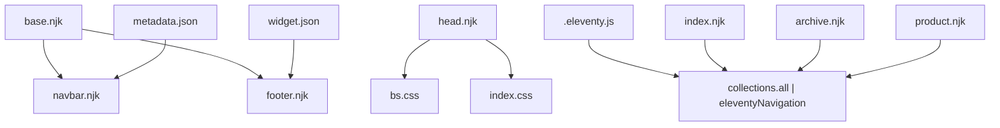
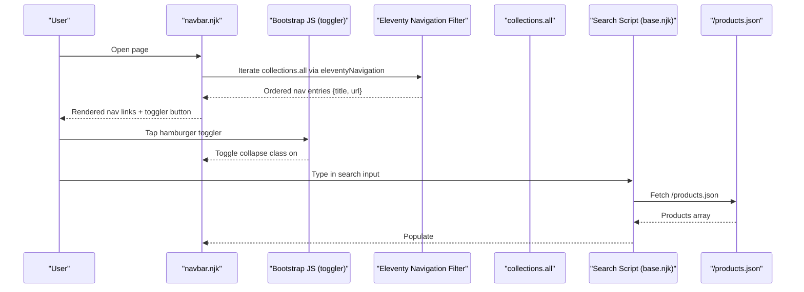
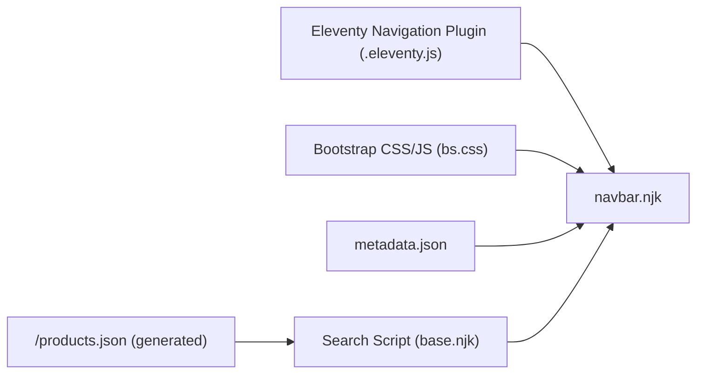

# Navigation Bar Widget

<cite>
**Referenced Files in This Document**
- [navbar.njk](file://_includes/widget/navbar.njk)
- [base.njk](file://_includes/layouts/base.njk)
- [head.njk](file://_includes/widget/head.njk)
- [footer.njk](file://_includes/widget/footer.njk)
- [.eleventy.js](file://.eleventy.js)
- [index.njk](file://index.njk)
- [archive.njk](file://archive.njk)
- [product.njk](file://product.njk)
- [metadata.json](file://_data/metadata.json)
- [widget.json](file://_data/widget.json)
- [bs.css](file://css/bs.css)
- [index.css](file://css/index.css)
</cite>

## Table of Contents
1. [Introduction](#introduction)
2. [Project Structure](#project-structure)
3. [Core Components](#core-components)
4. [Architecture Overview](#architecture-overview)
5. [Detailed Component Analysis](#detailed-component-analysis)
6. [Dependency Analysis](#dependency-analysis)
7. [Performance Considerations](#performance-considerations)
8. [Troubleshooting Guide](#troubleshooting-guide)
9. [Conclusion](#conclusion)
10. [Appendices](#appendices)

## Introduction
This document explains the navbar.njk navigation widget component used across the site. It covers responsive behavior, mobile hamburger menu functionality, dynamic link generation from Eleventy collections, active state handling, accessibility features, and integration with site metadata. It also provides guidance for adding new navigation items, customizing appearance, and integrating with site metadata, along with mobile-first design patterns, touch interactions, and cross-browser compatibility considerations.

## Project Structure
The navbar is included by the base layout and relies on Bootstrap classes and Eleventy’s navigation plugin to render links dynamically. The search feature is implemented client-side using a generated products JSON file.

**Diagram sources**
- [base.njk:1-4](file://_includes/layouts/base.njk#L1-L4)
- [navbar.njk:1-36](file://_includes/widget/navbar.njk#L1-L36)
- [footer.njk:27-35](file://_includes/widget/footer.njk#L27-L35)
- [head.njk:48-55](file://_includes/widget/head.njk#L48-L55)
- [.eleventy.js:5-13](file://.eleventy.js#L5-L13)
- [index.njk:3-6](file://index.njk#L3-L6)
- [archive.njk:6-8](file://archive.njk#L6-L8)
- [product.njk:6-8](file://product.njk#L6-L8)
- [metadata.json:1-10](file://_data/metadata.json#L1-L10)
- [widget.json:1-6](file://_data/widget.json#L1-L6)

**Section sources**
- [base.njk:1-4](file://_includes/layouts/base.njk#L1-L4)
- [navbar.njk:1-36](file://_includes/widget/navbar.njk#L1-L36)
- [head.njk:48-55](file://_includes/widget/head.njk#L48-L55)
- [.eleventy.js:5-13](file://.eleventy.js#L5-L13)
- [index.njk:3-6](file://index.njk#L3-L6)
- [archive.njk:6-8](file://archive.njk#L6-L8)
- [product.njk:6-8](file://product.njk#L6-L8)
- [metadata.json:1-10](file://_data/metadata.json#L1-L10)
- [widget.json:1-6](file://_data/widget.json#L1-L6)

## Core Components
- Navbar markup and toggler: Provides the responsive container, brand area, and collapsible menu controlled by Bootstrap’s data attributes.
- Dynamic navigation links: Built from Eleventy’s collections using the eleventyNavigation filter.
- Client-side product search: Integrated into the navbar with a results dropdown that filters a locally loaded products JSON.
- Metadata integration: Brand image and title are sourced from site metadata.

Key responsibilities:
- Render a consistent top-level navigation across pages.
- Collapse into a hamburger menu on small screens.
- Provide immediate product search without server round-trips.
- Keep accessibility attributes for screen readers and keyboard users.

**Section sources**
- [navbar.njk:1-36](file://_includes/widget/navbar.njk#L1-L36)
- [base.njk:6-61](file://_includes/layouts/base.njk#L6-L61)
- [metadata.json:1-10](file://_data/metadata.json#L1-L10)

## Architecture Overview
The navbar integrates with Eleventy’s navigation system and Bootstrap’s responsive utilities. Links are generated at build time from frontmatter configuration in page files. The search feature runs entirely in the browser after fetching a prebuilt JSON index.

**Diagram sources**
- [navbar.njk:11-14](file://_includes/widget/navbar.njk#L11-L14)
- [navbar.njk:4-9](file://_includes/widget/navbar.njk#L4-L9)
- [base.njk:7-61](file://_includes/layouts/base.njk#L7-L61)
- [.eleventy.js:5-13](file://.eleventy.js#L5-L13)

## Detailed Component Analysis

### Responsive Navigation and Hamburger Menu
- Uses Bootstrap’s navbar-expand-lg to show/hide the menu based on viewport width.
- Toggler button uses data-bs-toggle and data-bs-target to control the collapse region.
- The collapse container aligns content to the right on larger screens and stacks vertically on smaller screens.

Implementation highlights:
- Toggler aria attributes ensure assistive technologies can announce the toggle state.
- The collapse target ID matches the container ID for correct toggling.

**Section sources**
- [navbar.njk:1-9](file://_includes/widget/navbar.njk#L1-L9)
- [navbar.njk:10-15](file://_includes/widget/navbar.njk#L10-L15)

### Dynamic Link Generation from Eleventy Collections
- Nav links are generated by iterating collections.all through the eleventyNavigation filter.
- Each page defines an eleventyNavigation object with key and order to control label and sort order.

Where navigation items are defined:
- Home page entry
- Product list entry
- Blog archive entry

Notes:
- The URL is resolved via the url filter.
- The current page does not automatically receive an “active” class; see Active State Handling below.

**Section sources**
- [navbar.njk:12-14](file://_includes/widget/navbar.njk#L12-L14)
- [index.njk:3-6](file://index.njk#L3-L6)
- [product.njk:6-8](file://product.njk#L6-L8)
- [archive.njk:6-8](file://archive.njk#L6-L8)
- [.eleventy.js:5-13](file://.eleventy.js#L5-L13)

### Active State Handling
Current implementation applies the active class statically to all links. To improve UX:
- Compute the current path at render time and compare it with each entry’s URL.
- Apply the active class only when the entry URL matches the current page URL.

Recommended approach:
- Use the page’s permalink or URL to determine the active route.
- Compare against entry.url before rendering the link class.

**Section sources**
- [navbar.njk:12-14](file://_includes/widget/navbar.njk#L12-L14)

### Accessibility Features
- Semantic <nav> element with proper structure.
- Toggler includes aria-controls, aria-expanded, and aria-label to describe its purpose and state.
- Search input has role="search", aria-label, and autocomplete disabled for better UX.
- Results container is visually hidden initially and shown only when needed.

Recommendations:
- Ensure focus management when opening/closing the mobile menu.
- Add aria-live regions for search results if you plan to enhance them later.

**Section sources**
- [navbar.njk:4-9](file://_includes/widget/navbar.njk#L4-L9)
- [navbar.njk:17-26](file://_includes/widget/navbar.njk#L17-L26)

### Integration with Site Metadata
- Brand image and shop name are pulled from metadata.json.
- Language attribute in the HTML root comes from metadata.language.

Usage points:
- Navbar brand image alt text and icon source.
- Footer references additional metadata fields for business info and social links.

**Section sources**
- [navbar.njk:3](file://_includes/widget/navbar.njk#L3)
- [metadata.json:1-10](file://_data/metadata.json#L1-L10)
- [head.njk:2](file://_includes/widget/head.njk#L2)
- [footer.njk:51-61](file://_includes/widget/footer.njk#L51-L61)

### Client-Side Product Search
- On DOMContentLoaded, the script fetches /products.json once and caches the products array.
- On input events, it filters by title and description and renders a dropdown under the search field.
- Clicking outside hides the results.

Integration:
- The search input lives inside the navbar collapse container.
- The results box is absolutely positioned relative to the navbar.

**Section sources**
- [base.njk:7-61](file://_includes/layouts/base.njk#L7-L61)
- [navbar.njk:17-33](file://_includes/widget/navbar.njk#L17-L33)

### Mobile-First Design Patterns and Touch Interactions
- Bootstrap’s responsive utilities handle collapsing/expanding on small screens.
- The toggler is a standard button, ensuring good touch targets and keyboard support.
- The search input is accessible and works with virtual keyboards on mobile devices.

Considerations:
- Ensure tap targets meet minimum size guidelines.
- Avoid hover-only behaviors; rely on click/tap and focus states.

**Section sources**
- [navbar.njk:1-9](file://_includes/widget/navbar.njk#L1-L9)
- [head.njk:5](file://_includes/widget/head.njk#L5)

### Cross-Browser Compatibility
- Uses Bootstrap 5 data attributes for toggling and collapse.
- Relies on modern CSS classes and standard DOM APIs available in all supported browsers.
- Preload and noscript fallbacks for CSS ensure graceful degradation.

**Section sources**
- [head.njk:48-55](file://_includes/widget/head.njk#L48-L55)
- [navbar.njk:4-9](file://_includes/widget/navbar.njk#L4-L9)

## Dependency Analysis
The navbar depends on:
- Eleventy Navigation plugin to provide ordered navigation entries.
- Bootstrap CSS/JS for responsive layout and toggling.
- Site metadata for branding.
- A generated /products.json for client-side search.

**Diagram sources**
- [.eleventy.js:5-13](file://.eleventy.js#L5-L13)
- [navbar.njk:1-36](file://_includes/widget/navbar.njk#L1-36)
- [head.njk:48-55](file://_includes/widget/head.njk#L48-L55)
- [base.njk:7-61](file://_includes/layouts/base.njk#L7-L61)

**Section sources**
- [.eleventy.js:5-13](file://.eleventy.js#L5-L13)
- [navbar.njk:1-36](file://_includes/widget/navbar.njk#L1-36)
- [base.njk:7-61](file://_includes/layouts/base.njk#L7-L61)

## Performance Considerations
- The search script loads /products.json once and caches it in memory, minimizing network requests during typing.
- Images use lazy loading to defer offscreen resources.
- CSS is preloaded and applied asynchronously to avoid render blocking.

Optimization tips:
- Debounce the search input handler to reduce filtering work on rapid keystrokes.
- Limit the number of rendered results in the dropdown to keep the UI responsive.
- Consider pagination or virtualization if the product catalog grows significantly.

[No sources needed since this section provides general guidance]

## Troubleshooting Guide
Common issues and resolutions:
- Hamburger menu does not toggle:
  - Verify the toggler’s data-bs-target matches the collapse container ID.
  - Ensure Bootstrap JS is loaded and initialized.
- Links do not appear:
  - Confirm each page includes an eleventyNavigation object with key and order.
  - Check that collections.all is populated and the eleventyNavigation filter is enabled.
- Search returns no results:
  - Ensure /products.json exists and contains a products array with title/description fields.
  - Check console for fetch errors and verify CORS/network availability.
- Active state always shows on all links:
  - Implement dynamic active class logic based on the current page URL.

**Section sources**
- [navbar.njk:4-9](file://_includes/widget/navbar.njk#L4-L9)
- [navbar.njk:12-14](file://_includes/widget/navbar.njk#L12-L14)
- [base.njk:14-20](file://_includes/layouts/base.njk#L14-L20)

## Conclusion
The navbar.njk widget provides a responsive, accessible navigation bar with integrated client-side product search. It leverages Eleventy’s navigation plugin for dynamic link generation and Bootstrap for responsive behavior. By implementing dynamic active state logic and debounced search, you can further improve usability and performance.

[No sources needed since this section summarizes without analyzing specific files]

## Appendices

### How to Add a New Navigation Item
- In the target page’s frontmatter, add an eleventyNavigation object with key and order.
- Rebuild the site; the new item will appear in both the navbar and footer lists.

Example locations:
- Home page navigation entry
- Product list navigation entry
- Blog archive navigation entry

**Section sources**
- [index.njk:3-6](file://index.njk#L3-L6)
- [product.njk:6-8](file://product.njk#L6-L8)
- [archive.njk:6-8](file://archive.njk#L6-L8)
- [footer.njk:27-35](file://_includes/widget/footer.njk#L27-L35)

### Customizing Menu Appearance
- Modify Bootstrap utility classes on the navbar container, brand, and links to adjust spacing, colors, and alignment.
- Adjust the search form width and results dropdown positioning using inline styles or custom CSS.

Relevant files:
- Navbar markup and classes
- Global CSS for site-wide styling

**Section sources**
- [navbar.njk:1-36](file://_includes/widget/navbar.njk#L1-36)
- [index.css:1-52](file://css/index.css#L1-L52)

### Integrating with Site Metadata
- Update metadata.json to change the site title, shop name, and icon used in the navbar brand.
- The language attribute in the HTML root is driven by metadata.language.

**Section sources**
- [metadata.json:1-10](file://_data/metadata.json#L1-L10)
- [head.njk:2](file://_includes/widget/head.njk#L2)
- [navbar.njk:3](file://_includes/widget/navbar.njk#L3)