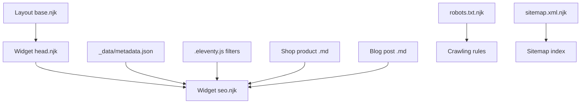
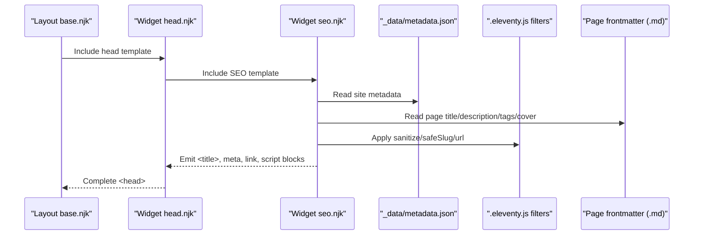
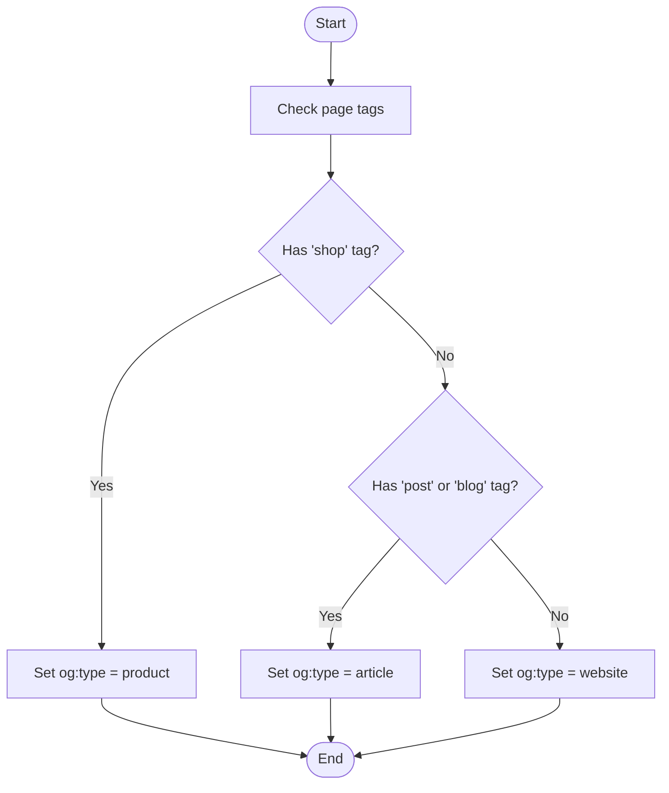
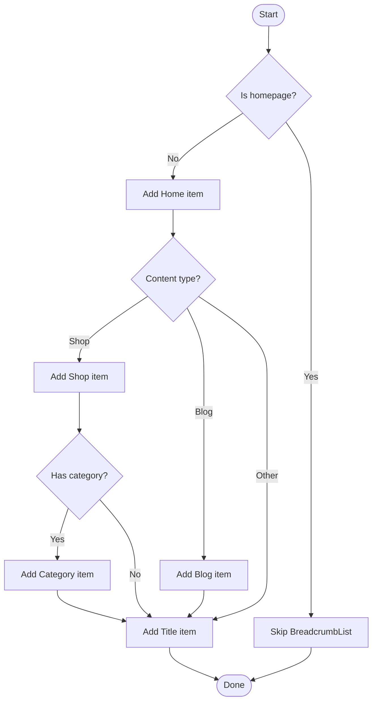
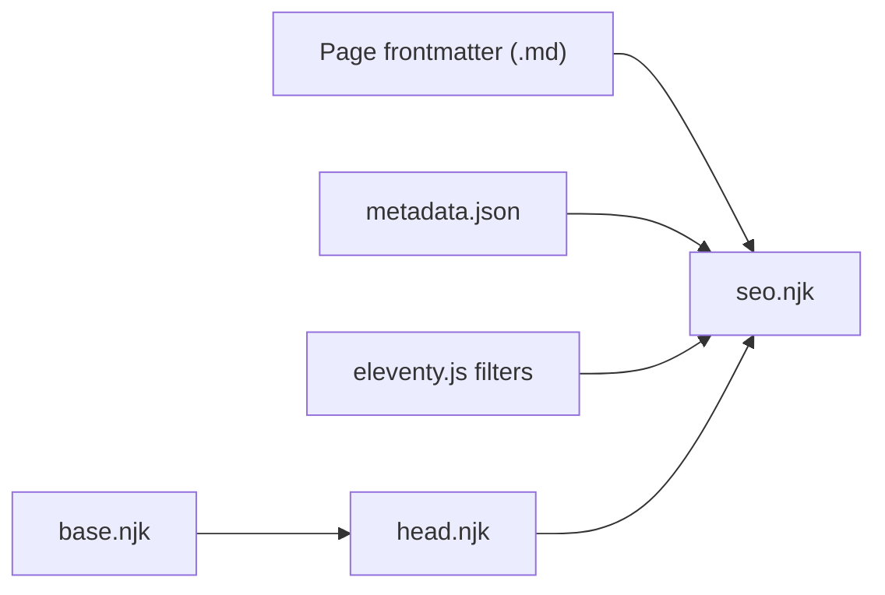

# SEO Widget

<cite>
**Referenced Files in This Document**
- [seo.njk](file://_includes/widget/seo.njk)
- [head.njk](file://_includes/widget/head.njk)
- [base.njk](file://_includes/layouts/base.njk)
- [metadata.json](file://_data/metadata.json)
- [robots.txt.njk](file://robots.txt.njk)
- [sitemap.xml.njk](file://sitemap.xml.njk)
- [eleventy.js](file://.eleventy.js)
- [B0CLHGCYRN.md](file://shop/B0CLHGCYRN.md)
- [best-gift-ideas-in-uae-2025.md](file://posts/best-gift-ideas-in-uae-2025.md)
</cite>

## Table of Contents
1. Introduction
2. Project Structure
3. Core Components
4. Architecture Overview
5. Detailed Component Analysis
6. Dependency Analysis
7. Performance Considerations
8. Troubleshooting Guide
9. Conclusion
10. Appendices

## Introduction
This document explains the SEO widget implementation used to generate search engine optimization metadata and structured data across pages. It covers title tags, meta descriptions, Open Graph tags, Twitter Cards, canonical URLs, robots directives, Google verification, and schema.org markup for products, articles, organization/homepage, and breadcrumbs. It also documents how dynamic context (tags, page type, frontmatter fields) drives SEO output, and provides guidance on customization, best practices, mobile signals, and crawling considerations.

## Project Structure
The SEO system is centered around a reusable include that renders head-level SEO elements. The layout includes this SEO component within the HTML head, while global site metadata is provided via a JSON file. Robots and sitemap files are generated as Eleventy templates.

**Diagram sources**
- [base.njk:1-4](file://_includes/layouts/base.njk#L1-L4)
- [head.njk:1-10](file://_includes/widget/head.njk#L1-L10)
- [seo.njk:1-45](file://_includes/widget/seo.njk#L1-L45)
- [metadata.json:1-47](file://_data/metadata.json#L1-L47)
- [eleventy.js:68-70](file://.eleventy.js#L68-L70)
- [robots.txt.njk:1-8](file://robots.txt.njk#L1-L8)
- [sitemap.xml.njk:1-6](file://sitemap.xml.njk#L1-L6)

**Section sources**
- [base.njk:1-4](file://_includes/layouts/base.njk#L1-L4)
- [head.njk:1-10](file://_includes/widget/head.njk#L1-L10)
- [seo.njk:1-45](file://_includes/widget/seo.njk#L1-L45)
- [metadata.json:1-47](file://_data/metadata.json#L1-L47)
- [robots.txt.njk:1-8](file://robots.txt.njk#L1-L8)
- [sitemap.xml.njk:1-6](file://sitemap.xml.njk#L1-L6)

## Core Components
- SEO include: Generates all head-level SEO tags and structured data based on page context and global metadata.
- Head include: Provides viewport and mobile PWA hints, preloads, and includes the SEO component.
- Global metadata: Centralized site-wide values such as title, description, locale, social handles, and business info.
- Filters: Sanitization and slug helpers used by the SEO component to ensure safe and valid outputs.
- Crawling assets: robots.txt and sitemap.xml templates to guide crawlers.

Key responsibilities:
- Title and description fallbacks from page frontmatter to global metadata.
- Dynamic Open Graph type selection based on tags.
- Twitter Card configuration with image alt text.
- Canonical URL generation.
- Schema.org Product, Article, Organization/WebSite, and BreadcrumbList.

**Section sources**
- [seo.njk:1-45](file://_includes/widget/seo.njk#L1-L45)
- [head.njk:1-10](file://_includes/widget/head.njk#L1-L10)
- [metadata.json:1-47](file://_data/metadata.json#L1-L47)
- [eleventy.js:68-70](file://.eleventy.js#L68-L70)

## Architecture Overview
The rendering pipeline integrates Eleventy’s templating with per-page frontmatter and global metadata to produce SEO-ready HTML.

**Diagram sources**
- [base.njk:1-4](file://_includes/layouts/base.njk#L1-L4)
- [head.njk:1-10](file://_includes/widget/head.njk#L1-L10)
- [seo.njk:1-45](file://_includes/widget/seo.njk#L1-L45)
- [metadata.json:1-47](file://_data/metadata.json#L1-L47)
- [eleventy.js:68-70](file://.eleventy.js#L68-L70)

## Detailed Component Analysis

### SEO Include: Meta Tags and Structured Data
Responsibilities:
- Title tag with fallback to global metadata.
- Meta description with consistent usage across standard, OG, and Twitter.
- Open Graph tags including dynamic type selection based on tags.
- Twitter Cards with summary_large_image and image alt.
- Facebook-specific placeholders for title and image.
- Robots directive set to index/follow.
- Google Site Verification meta.
- Canonical link using absolute URL.
- Schema.org JSON-LD for:
  - Product (when tagged shop).
  - Article (when tagged post or blog).
  - Organization + WebSite (on homepage).
  - BreadcrumbList (non-home pages, with conditional Shop/Blog paths).

Dynamic behavior:
- og:type switches between website, product, and article depending on presence of tags like shop, post, or blog.
- Image source falls back to cover if present, otherwise uses global banner.
- Author and publisher details come from global metadata.
- Breadcrumbs adapt to content type and optional category.

Customization points:
- Override per-page title/description/cover via frontmatter.
- Add custom meta tags inside the SEO include or head include.
- Extend schema.org types by adding new branches in the include.

Best practices embedded:
- Single canonical URL per page.
- Consistent image alt for accessibility and social previews.
- Locale and site name set globally.

**Section sources**
- [seo.njk:1-45](file://_includes/widget/seo.njk#L1-L45)
- [seo.njk:46-185](file://_includes/widget/seo.njk#L46-L185)
- [seo.njk:187-252](file://_includes/widget/seo.njk#L187-L252)

#### Open Graph Type Selection Logic

**Diagram sources**
- [seo.njk:12-17](file://_includes/widget/seo.njk#L12-L17)

#### BreadcrumbList Generation Flow

**Diagram sources**
- [seo.njk:187-252](file://_includes/widget/seo.njk#L187-L252)

### Head Include: Mobile Signals and Preloads
Responsibilities:
- Viewport meta for responsive design.
- Theme color and PWA capability hints.
- Preloading critical CSS and deferred JS for performance.
- Including the SEO component.
- Adding generator and developer meta.
- Alternate feed links for Atom and JSON Feed.
- DNS prefetch/preconnect for external CDNs.

Mobile optimization signals:
- Responsive viewport and theme-color.
- PWA flags for web app installability.
- Efficient resource loading patterns.

**Section sources**
- [head.njk:1-10](file://_includes/widget/head.njk#L1-L10)
- [head.njk:42-58](file://_includes/widget/head.njk#L42-L58)

### Layout Base: Integration Point
Responsibilities:
- Includes head, navbar, content, and footer.
- Adds client-side search script (not part of SEO but relevant for UX).

SEO integration:
- Ensures SEO component is included early in the head via the head include.

**Section sources**
- [base.njk:1-4](file://_includes/layouts/base.njk#L1-L4)

### Global Metadata: Source of Truth
Provides:
- Site title, description, URL, locale, icon, and social handles.
- Business information for Organization schema.
- Feed endpoints for Atom and JSON Feed.

Usage:
- Referenced by the SEO include for defaults and schema.org fields.

**Section sources**
- [metadata.json:1-47](file://_data/metadata.json#L1-L47)

### Filters and Utilities: Safety and Slugs
Responsibilities:
- sanitize filter to escape quotes and normalize whitespace for JSON-LD strings.
- safeSlug filter to create clean, platform-safe slugs for tag-based URLs.
- url filter to build absolute URLs.

Impact on SEO:
- Prevents malformed JSON-LD due to special characters.
- Ensures canonical and breadcrumb URLs are correct and crawlable.

**Section sources**
- [eleventy.js:68-70](file://.eleventy.js#L68-L70)
- [eleventy.js:51-62](file://.eleventy.js#L51-L62)

### Crawling Configuration: Robots and Sitemap
- robots.txt allows crawling and references sitemap location.
- sitemap.xml template includes a widget that enumerates pages.

Considerations:
- Ensure sitemap is updated after builds.
- Verify robots rules align with site structure.

**Section sources**
- [robots.txt.njk:1-8](file://robots.txt.njk#L1-L8)
- [sitemap.xml.njk:1-6](file://sitemap.xml.njk#L1-L6)

## Dependency Analysis
The SEO system depends on:
- Page frontmatter fields (title, description, cover, tags, date, etc.).
- Global metadata for defaults and organization details.
- Eleventy filters for sanitization and URL handling.
- Layout inclusion chain to inject into the final HTML head.

**Diagram sources**
- [seo.njk:1-45](file://_includes/widget/seo.njk#L1-L45)
- [head.njk:1-10](file://_includes/widget/head.njk#L1-L10)
- [base.njk:1-4](file://_includes/layouts/base.njk#L1-L4)
- [metadata.json:1-47](file://_data/metadata.json#L1-L47)
- [eleventy.js:68-70](file://.eleventy.js#L68-L70)

**Section sources**
- [seo.njk:1-45](file://_includes/widget/seo.njk#L1-L45)
- [head.njk:1-10](file://_includes/widget/head.njk#L1-L10)
- [base.njk:1-4](file://_includes/layouts/base.njk#L1-L4)
- [metadata.json:1-47](file://_data/metadata.json#L1-L47)
- [eleventy.js:68-70](file://.eleventy.js#L68-L70)

## Performance Considerations
- Use preload and defer strategies already present in the head include for critical resources.
- Keep meta tags minimal and avoid heavy inline scripts in the head.
- Prefer server-rendered canonical URLs and structured data to reduce client overhead.
- Optimize images referenced by meta tags and schema.org for faster social previews and indexing.

[No sources needed since this section provides general guidance]

## Troubleshooting Guide
Common issues and resolutions:
- Missing or incorrect title/description:
  - Ensure page frontmatter defines title and description; otherwise, they fall back to global metadata.
  - Verify global metadata contains expected values.
- Incorrect Open Graph type:
  - Confirm tags include shop, post, or blog as appropriate.
- Broken canonical or image URLs:
  - Check site.url and page.url usage; verify cover/banner paths exist.
- Malformed JSON-LD:
  - Ensure sanitize filter is applied to strings containing quotes or newlines.
- Breadcrumbs not showing:
  - Non-home pages should have proper tags and category where applicable.
- Crawling problems:
  - Validate robots.txt allows intended paths and sitemap reference is correct.

**Section sources**
- [seo.njk:1-45](file://_includes/widget/seo.njk#L1-L45)
- [seo.njk:46-185](file://_includes/widget/seo.njk#L46-L185)
- [seo.njk:187-252](file://_includes/widget/seo.njk#L187-L252)
- [eleventy.js:68-70](file://.eleventy.js#L68-L70)
- [robots.txt.njk:1-8](file://robots.txt.njk#L1-L8)

## Conclusion
The SEO widget centralizes and automates essential SEO metadata and structured data across the site. By leveraging page frontmatter and global metadata, it ensures consistent titles, descriptions, social previews, canonical URLs, and rich schema.org markup. With clear extension points and robust filtering, it supports customization and advanced SEO features while adhering to best practices for mobile and crawling.

[No sources needed since this section summarizes without analyzing specific files]

## Appendices

### Customizing SEO Rules and Adding Custom Meta Tags
- Override per-page values:
  - Provide title, description, and cover in page frontmatter to override defaults.
- Add custom meta tags:
  - Insert additional meta elements in the SEO include or head include for specialized needs.
- Extend schema.org:
  - Add new JSON-LD blocks in the SEO include for specialized entities beyond Product, Article, Organization, WebSite, and BreadcrumbList.

Examples of frontmatter fields used by the SEO system:
- For shop pages:
  - title, description, cover, ecwidId, price, tags (including shop), category.
- For blog posts:
  - title, description, cover, date, tags (including post or blog).

**Section sources**
- [B0CLHGCYRN.md:1-25](file://shop/B0CLHGCYRN.md#L1-L25)
- [best-gift-ideas-in-uae-2025.md:1-28](file://posts/best-gift-ideas-in-uae-2025.md#L1-L28)
- [seo.njk:1-45](file://_includes/widget/seo.njk#L1-L45)
- [seo.njk:46-185](file://_includes/widget/seo.njk#L46-L185)
- [seo.njk:187-252](file://_includes/widget/seo.njk#L187-L252)

### SEO Best Practices Embedded
- Unique title and description per page.
- Consistent Open Graph and Twitter Card coverage.
- Canonical URL to prevent duplicate content.
- Proper schema.org markup for rich results.
- Mobile-friendly viewport and PWA hints.
- Clean slugs and safe string escaping for JSON-LD.

**Section sources**
- [seo.njk:1-45](file://_includes/widget/seo.njk#L1-L45)
- [head.njk:1-10](file://_includes/widget/head.njk#L1-L10)
- [eleventy.js:68-70](file://.eleventy.js#L68-L70)

### Search Engine Crawling Considerations
- robots.txt allows crawling and points to sitemap.
- sitemap.xml template aggregates pages for discovery.
- Ensure no accidental noindex directives and keep canonical URLs accurate.

**Section sources**
- [robots.txt.njk:1-8](file://robots.txt.njk#L1-L8)
- [sitemap.xml.njk:1-6](file://sitemap.xml.njk#L1-L6)