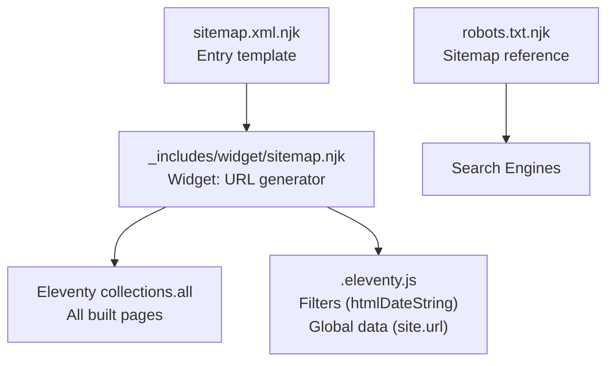
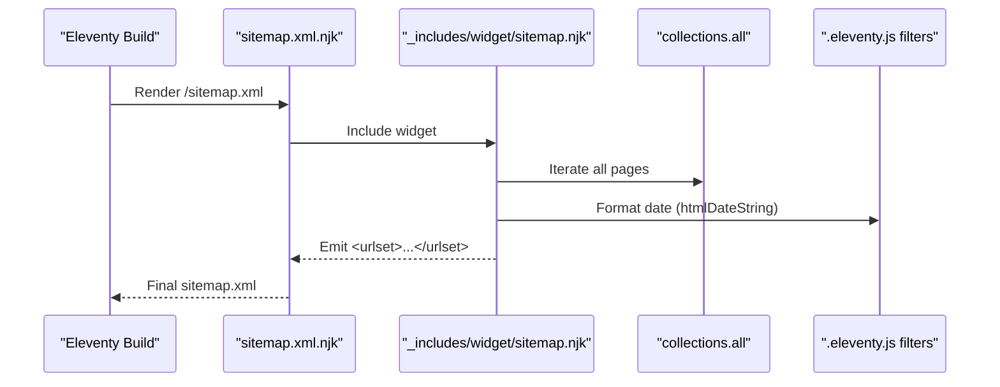
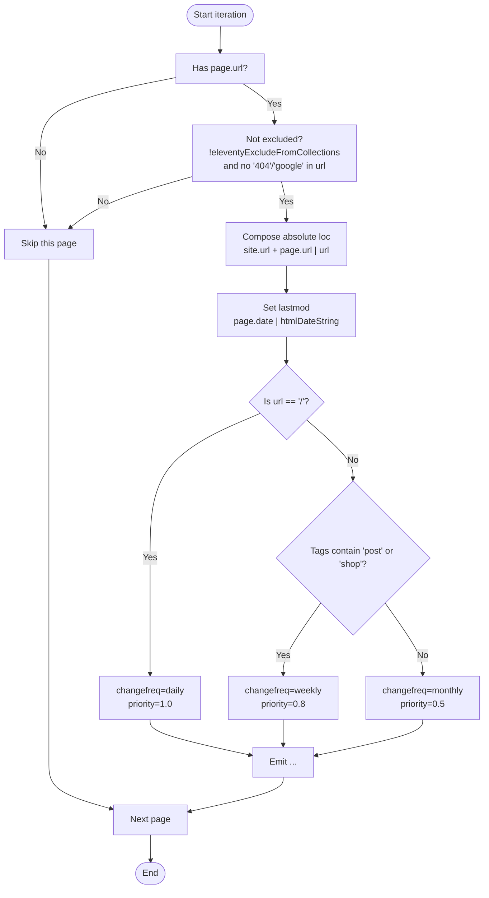
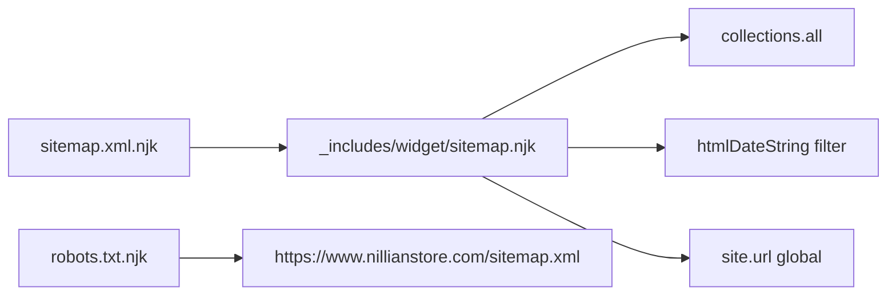

# Sitemap Widget

<cite>
**Referenced Files in This Document**
- [sitemap.xml.njk](file://sitemap.xml.njk)
- [_includes/widget/sitemap.njk](file://_includes/widget/sitemap.njk)
- [.eleventy.js](file://.eleventy.js)
- [robots.txt.njk](file://robots.txt.njk)
- [posts\posts.json](file://posts/posts.json)
- [shop\shop.json](file://shop/shop.json)
- [page-list.njk](file://page-list.njk)
</cite>

## Table of Contents
1. [Introduction](#introduction)
2. [Project Structure](#project-structure)
3. [Core Components](#core-components)
4. [Architecture Overview](#architecture-overview)
5. [Detailed Component Analysis](#detailed-component-analysis)
6. [Dependency Analysis](#dependency-analysis)
7. [Performance Considerations](#performance-considerations)
8. [Troubleshooting Guide](#troubleshooting-guide)
9. [Conclusion](#conclusion)
10. [Appendices](#appendices)

## Introduction
This document explains the sitemap.njk widget component and how it generates an XML sitemap for the site. It covers automatic discovery of pages, products, and blog posts; URL prioritization and change frequency hints; last modification date tracking; customization options; exclusion rules; and SEO best practices including submission to search engines.

## Project Structure
The sitemap is generated by a small entry template that includes a reusable widget. The widget iterates over Eleventy’s global collection to emit <url> entries with location, last modified date, change frequency, and priority.

**Diagram sources**
- [sitemap.xml.njk:1-6](file://sitemap.xml.njk#L1-L6)
- [_includes/widget/sitemap.njk:1-22](file://_includes/widget/sitemap.njk#L1-L22)
- [.eleventy.js:15-37](file://.eleventy.js#L15-L37)
- [robots.txt.njk:1-8](file://robots.txt.njk#L1-L8)

**Section sources**
- [sitemap.xml.njk:1-6](file://sitemap.xml.njk#L1-L6)
- [_includes/widget/sitemap.njk:1-22](file://_includes/widget/sitemap.njk#L1-L22)
- [.eleventy.js:15-37](file://.eleventy.js#L15-L37)
- [robots.txt.njk:1-8](file://robots.txt.njk#L1-L8)

## Core Components
- Entry template: Produces /sitemap.xml and includes the widget.
- Widget: Iterates all pages, filters out excluded or internal URLs, and emits <url> elements with loc, lastmod, changefreq, and priority.
- Filters and globals: htmlDateString formats dates; site.url provides absolute base URL.

Key behaviors:
- Automatic discovery: Uses collections.all to include every page Eleventy builds.
- Exclusions: Skips pages marked with eleventyExcludeFromCollections and filters out URLs containing “404” or “google”.
- Prioritization: Root gets highest priority; tagged content (“post”, “shop”) gets medium; others get lower.
- Change frequency: Root daily; tagged weekly; others monthly.
- Last modification: Uses each page’s date via htmlDateString filter.

**Section sources**
- [sitemap.xml.njk:1-6](file://sitemap.xml.njk#L1-L6)
- [_includes/widget/sitemap.njk:1-22](file://_includes/widget/sitemap.njk#L1-L22)
- [.eleventy.js:30-32](file://.eleventy.js#L30-L32)
- [.eleventy.js:15-16](file://.eleventy.js#L15-L16)

## Architecture Overview
The sitemap generation flow is straightforward: build-time rendering of a Nunjucks template that includes the widget, which reads Eleventy’s global collection and outputs XML.

**Diagram sources**
- [sitemap.xml.njk:1-6](file://sitemap.xml.njk#L1-L6)
- [_includes/widget/sitemap.njk:1-22](file://_includes/widget/sitemap.njk#L1-L22)
- [.eleventy.js:30-32](file://.eleventy.js#L30-L32)

## Detailed Component Analysis

### Sitemap Entry Template
- Purpose: Define permalink for the sitemap and include the reusable widget.
- Behavior: Sets permalink to /sitemap.xml and excludes itself from collections.

SEO implications:
- Ensures a canonical sitemap endpoint at the root path.
- Avoids self-inclusion in the sitemap to prevent recursion.

**Section sources**
- [sitemap.xml.njk:1-6](file://sitemap.xml.njk#L1-L6)

### Sitemap Widget (_includes/widget/sitemap.njk)
- Purpose: Generate the XML <urlset> by iterating Eleventy’s global collection.
- Discovery logic:
  - Includes any page with a valid url.
  - Excludes pages where eleventyExcludeFromCollections is true.
  - Excludes URLs containing “404” or “google”.
- URL composition:
  - Combines site.url with page.url using the url filter to ensure absolute paths.
- Date handling:
  - Uses page.date formatted via htmlDateString to produce YYYY-MM-DD for lastmod.
- Priority and change frequency:
  - Root (“/”) → priority 1.0, changefreq daily.
  - Pages tagged with “post” or “shop” → priority 0.8, changefreq weekly.
  - All other pages → priority 0.5, changefreq monthly.

**Diagram sources**
- [_includes/widget/sitemap.njk:1-22](file://_includes/widget/sitemap.njk#L1-L22)
- [.eleventy.js:30-32](file://.eleventy.js#L30-L32)
- [.eleventy.js:15-16](file://.eleventy.js#L15-L16)

**Section sources**
- [_includes/widget/sitemap.njk:1-22](file://_includes/widget/sitemap.njk#L1-L22)
- [.eleventy.js:30-32](file://.eleventy.js#L30-L32)
- [.eleventy.js:15-16](file://.eleventy.js#L15-L16)

### How Pages, Products, and Blog Posts Are Discovered
- Collections.all contains every page Eleventy builds, including:
  - Markdown pages under page/
  - Blog posts under posts/
  - Shop product pages under shop/
- Tags used for prioritization:
  - “post” tag on blog posts
  - “shop” tag on product pages
- Collection metadata files:
  - posts/posts.json defines tags for the posts collection context.
  - shop/shop.json defines tags for the shop collection context.

Note: The widget does not rely on named collections; it uses the global collections.all. Therefore, any page included in the build will be considered unless explicitly excluded.

**Section sources**
- [page-list.njk:1-11](file://page-list.njk#L1-L11)
- [posts/posts.json:1-6](file://posts/posts.json#L1-L6)
- [shop/shop.json:1-4](file://shop/shop.json#L1-L4)

### Customizing Sitemap Structure
Common customizations you can implement by editing the widget:
- Add additional exclusions:
  - Extend the condition to skip specific patterns (e.g., admin routes).
- Adjust priorities and frequencies:
  - Introduce new tag-based rules (e.g., “featured” or “landing”).
- Include optional fields:
  - Add <xhtml:link rel="alternate" hreflang="..."> for multilingual sites.
  - Add <image:image> blocks if needed for image sitemaps.
- Use alternative date sources:
  - Prefer frontmatter updatedAt when available, otherwise fall back to date.

Implementation guidance:
- Modify the conditional block inside the widget to add new rules.
- Ensure any new fields are valid per the Sitemap protocol.

[No sources needed since this section provides general guidance]

### Excluding Specific URLs
Current exclusions:
- Pages with eleventyExcludeFromCollections set to true.
- URLs containing “404” or “google”.

To exclude more:
- Add additional string checks in the widget’s condition.
- Or mark pages with eleventyExcludeFromCollections: true in their frontmatter.

**Section sources**
- [_includes/widget/sitemap.njk:4](file://_includes/widget/sitemap.njk#L4)

### Implementing Sitemap Indexing
For large sites, split into multiple sitemaps and create an index:
- Create multiple sitemap templates (e.g., posts-sitemap.xml, shop-sitemap.xml).
- Each template filters collections.all by tags or paths.
- Create an index template that lists each sitemap URL.
- Reference the index in robots.txt instead of individual sitemaps.

Conceptual steps:
- Add a new index template with permalink /sitemap-index.xml.
- In the index, list absolute URLs to each sub-sitemap.
- Update robots.txt to point to the index.

[No sources needed since this section provides general guidance]

### SEO Implications and Best Practices
- URL prioritization:
  - Higher priority signals importance to crawlers; keep it realistic.
- Change frequency:
  - Hints only; use values that reflect actual update cadence.
- Last modification dates:
  - Accurate lastmod helps crawlers focus on fresh content.
- Robots.txt integration:
  - Ensure robots.txt points to the correct sitemap URL.
- Submission process:
  - Submit sitemap via Google Search Console and Bing Webmaster Tools.
  - Keep the sitemap up-to-date after major content changes.

[No sources needed since this section provides general guidance]

## Dependency Analysis
The sitemap depends on Eleventy’s build-time data and filters.

**Diagram sources**
- [_includes/widget/sitemap.njk:1-22](file://_includes/widget/sitemap.njk#L1-L22)
- [sitemap.xml.njk:1-6](file://sitemap.xml.njk#L1-L6)
- [.eleventy.js:30-32](file://.eleventy.js#L30-L32)
- [.eleventy.js:15-16](file://.eleventy.js#L15-L16)
- [robots.txt.njk:1-8](file://robots.txt.njk#L1-L8)

**Section sources**
- [_includes/widget/sitemap.njk:1-22](file://_includes/widget/sitemap.njk#L1-L22)
- [sitemap.xml.njk:1-6](file://sitemap.xml.njk#L1-L6)
- [.eleventy.js:30-32](file://.eleventy.js#L30-L32)
- [.eleventy.js:15-16](file://.eleventy.js#L15-L16)
- [robots.txt.njk:1-8](file://robots.txt.njk#L1-L8)

## Performance Considerations
- The widget iterates collections.all once during build time; this is efficient for typical site sizes.
- If the site grows very large, consider splitting into multiple sitemaps to reduce single-file size.
- Avoid heavy computations inside the loop; keep conditions simple.

[No sources needed since this section provides general guidance]

## Troubleshooting Guide
- Missing lastmod values:
  - Ensure each page has a date in frontmatter.
  - Verify htmlDateString filter is registered.
- Unexpected URLs included:
  - Check for eleventyExcludeFromCollections flags.
  - Review exclusion patterns for “404” and “google”.
- Incorrect absolute URLs:
  - Confirm site.url is set correctly.
  - Ensure the url filter is applied to page.url.
- Sitemap not referenced:
  - Verify robots.txt points to the correct sitemap URL.

**Section sources**
- [_includes/widget/sitemap.njk:6-7](file://_includes/widget/sitemap.njk#L6-L7)
- [.eleventy.js:30-32](file://.eleventy.js#L30-L32)
- [.eleventy.js:15-16](file://.eleventy.js#L15-L16)
- [robots.txt.njk:1-8](file://robots.txt.njk#L1-L8)

## Conclusion
The sitemap.njk widget provides a concise, maintainable way to generate an XML sitemap that automatically discovers all built pages, applies sensible prioritization and change frequency hints, and tracks last modification dates. With minimal configuration, it integrates cleanly with Eleventy and supports standard SEO workflows, including robots.txt referencing and search engine submission.

[No sources needed since this section summarizes without analyzing specific files]

## Appendices

### Quick Reference: Key Behaviors
- Discovery: collections.all
- Exclusions: eleventyExcludeFromCollections, “404”, “google”
- Absolute URLs: site.url + page.url | url
- Dates: page.date | htmlDateString
- Rules:
  - Root → priority 1.0, changefreq daily
  - Tagged “post” or “shop” → priority 0.8, changefreq weekly
  - Others → priority 0.5, changefreq monthly

**Section sources**
- [_includes/widget/sitemap.njk:1-22](file://_includes/widget/sitemap.njk#L1-L22)
- [.eleventy.js:30-32](file://.eleventy.js#L30-L32)
- [.eleventy.js:15-16](file://.eleventy.js#L15-L16)