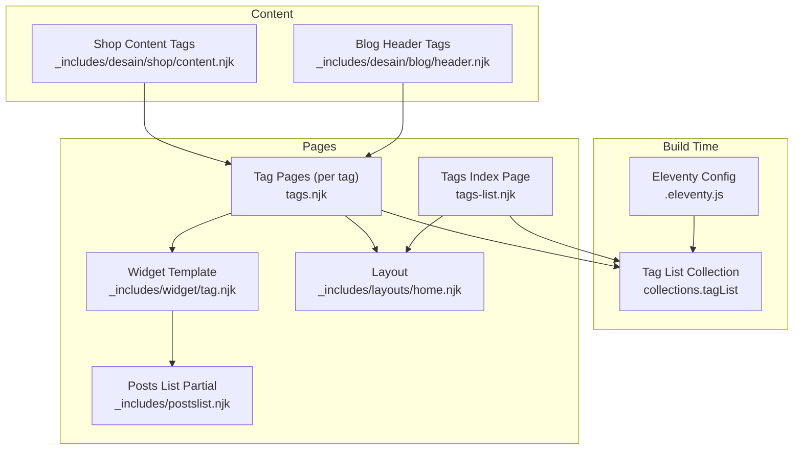
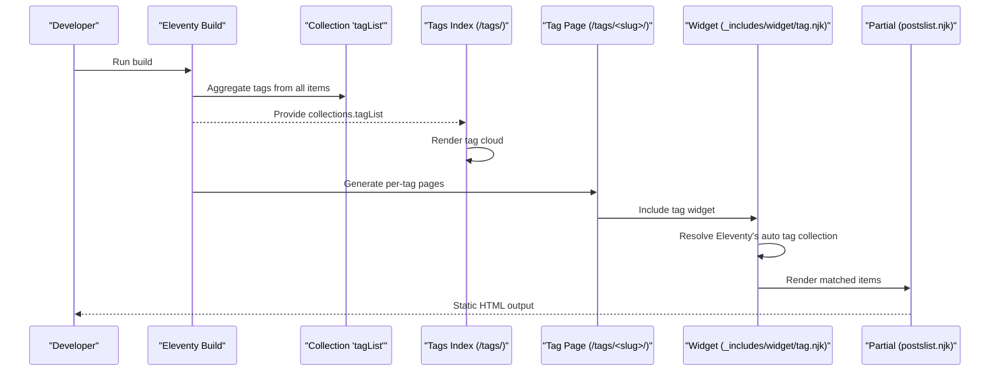
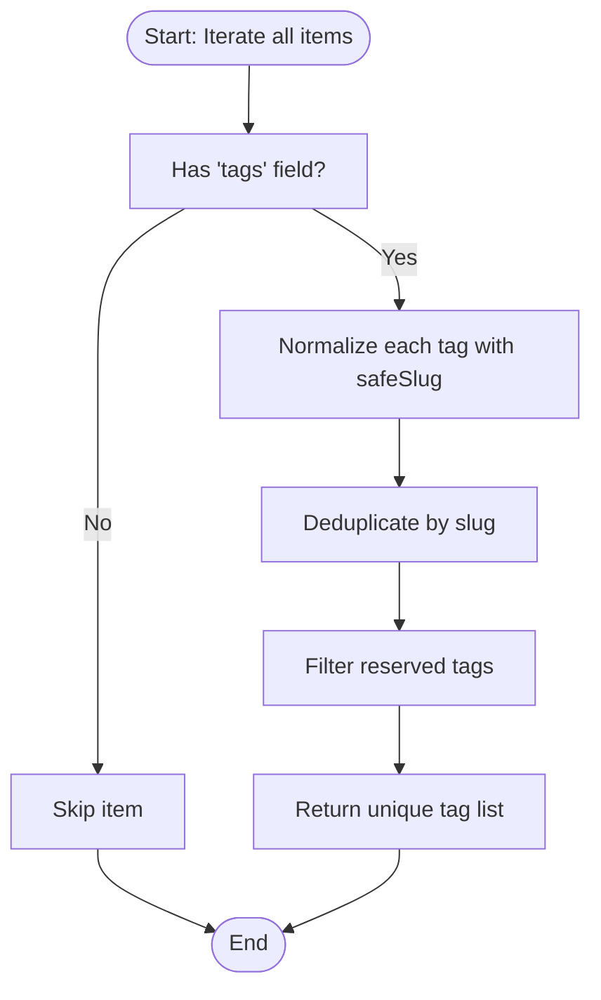
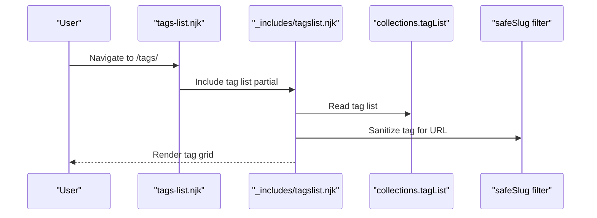
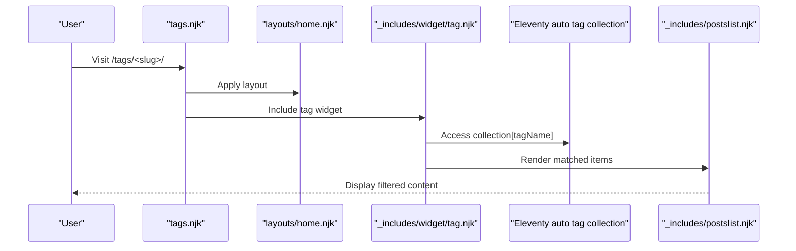
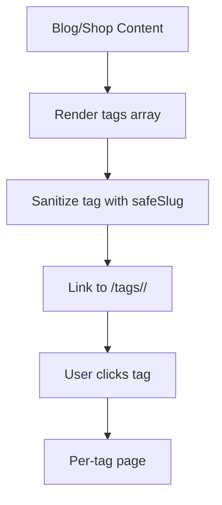
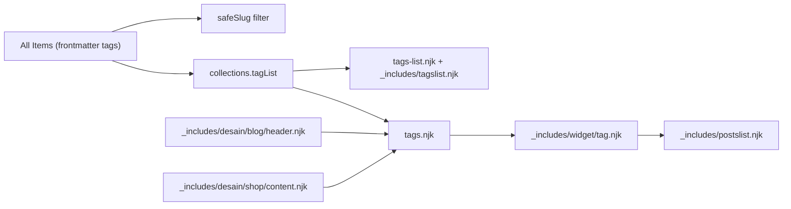

# Tag Management Widget

<cite>
**Referenced Files in This Document**
- [.eleventy.js](file://.eleventy.js)
- [tags.njk](file://tags.njk)
- [tags-list.njk](file://tags-list.njk)
- [_includes/widget/tag.njk](file://_includes/widget/tag.njk)
- [_includes/tagslist.njk](file://_includes/tagslist.njk)
- [_includes/postslist.njk](file://_includes/postslist.njk)
- [_includes/layouts/home.njk](file://_includes/layouts/home.njk)
- [_includes/desain/shop/content.njk](file://_includes/desain/shop/content.njk)
- [_includes/desain/blog/header.njk](file://_includes/desain/blog/header.njk)
</cite>

## Table of Contents
1. [Introduction](#introduction)
2. [Project Structure](#project-structure)
3. [Core Components](#core-components)
4. [Architecture Overview](#architecture-overview)
5. [Detailed Component Analysis](#detailed-component-analysis)
6. [Dependency Analysis](#dependency-analysis)
7. [Performance Considerations](#performance-considerations)
8. [Troubleshooting Guide](#troubleshooting-guide)
9. [Conclusion](#conclusion)
10. [Appendices](#appendices)

## Introduction
This document explains the tag management widget and how it powers tag-based content organization, dynamic tag cloud generation, and filtered content display across the site. It covers how tags are extracted from frontmatter, aggregated into a global list, rendered as a tag cloud, and used to filter posts and shop items. It also provides guidance for creating custom tag displays, implementing tag-based navigation, managing tag hierarchies, and optimizing performance for large tag sets.

## Project Structure
The tag system is implemented using Eleventy collections and Nunjucks templates:
- A custom collection builds a unique, normalized list of all tags across the site.
- A dedicated page renders a tag cloud by iterating over that list.
- A paginated template generates one page per tag, showing matching content.
- The widget includes a reusable snippet that renders the filtered results.
- Content pages (blog and shop) include inline tag links for navigation.

**Diagram sources**
- [.eleventy.js:74-95](file://.eleventy.js#L74-L95)
- [tags-list.njk:1-7](file://tags-list.njk#L1-L7)
- [tags.njk:1-12](file://tags.njk#L1-L12)
- [_includes/widget/tag.njk:1-6](file://_includes/widget/tag.njk#L1-L6)
- [_includes/postslist.njk:1-10](file://_includes/postslist.njk#L1-L10)
- [_includes/layouts/home.njk:1-5](file://_includes/layouts/home.njk#L1-L5)
- [_includes/desain/blog/header.njk:1-17](file://_includes/desain/blog/header.njk#L1-L17)
- [_includes/desain/shop/content.njk:84-95](file://_includes/desain/shop/content.njk#L84-L95)

**Section sources**
- [.eleventy.js:74-95](file://.eleventy.js#L74-L95)
- [tags-list.njk:1-7](file://tags-list.njk#L1-L7)
- [tags.njk:1-12](file://tags.njk#L1-L12)
- [_includes/widget/tag.njk:1-6](file://_includes/widget/tag.njk#L1-L6)
- [_includes/postslist.njk:1-10](file://_includes/postslist.njk#L1-L10)
- [_includes/layouts/home.njk:1-5](file://_includes/layouts/home.njk#L1-L5)
- [_includes/desain/blog/header.njk:1-17](file://_includes/desain/blog/header.njk#L1-L17)
- [_includes/desain/shop/content.njk:84-95](file://_includes/desain/shop/content.njk#L84-L95)

## Core Components
- Tag aggregation and normalization:
  - A custom collection iterates all items, reads their frontmatter tags, normalizes them with a safe slug filter, deduplicates, and filters out reserved names.
- Tag cloud index:
  - A page at /tags/ renders a grid of clickable tags built from the aggregated list.
- Per-tag pages:
  - A single template generates one page per tag, with a URL derived from the sanitized tag name.
- Tagged content rendering:
  - The widget uses Eleventy’s automatic tag collections to fetch items tagged with the current tag and renders them via a shared partial.
- Inline tag links:
  - Blog and shop content templates render inline tags linking to the corresponding tag pages.

Key implementation references:
- Tag aggregation and filtering: [.eleventy.js:74-95](file://.eleventy.js#L74-L95), [.eleventy.js:64-66](file://.eleventy.js#L64-L66), [.eleventy.js:51-62](file://.eleventy.js#L51-L62)
- Tag cloud index: [tags-list.njk:1-7](file://tags-list.njk#L1-L7), [_includes/tagslist.njk:1-10](file://_includes/tagslist.njk#L1-L10)
- Per-tag pages: [tags.njk:1-12](file://tags.njk#L1-L12)
- Tagged content rendering: [_includes/widget/tag.njk:1-6](file://_includes/widget/tag.njk#L1-L6), [_includes/postslist.njk:1-10](file://_includes/postslist.njk#L1-L10)
- Inline tag links: [_includes/desain/blog/header.njk:1-17](file://_includes/desain/blog/header.njk#L1-L17), [_includes/desain/shop/content.njk:84-95](file://_includes/desain/shop/content.njk#L84-L95)

**Section sources**
- [.eleventy.js:51-62](file://.eleventy.js#L51-L62)
- [.eleventy.js:64-66](file://.eleventy.js#L64-L66)
- [.eleventy.js:74-95](file://.eleventy.js#L74-L95)
- [tags-list.njk:1-7](file://tags-list.njk#L1-L7)
- [_includes/tagslist.njk:1-10](file://_includes/tagslist.njk#L1-L10)
- [tags.njk:1-12](file://tags.njk#L1-L12)
- [_includes/widget/tag.njk:1-6](file://_includes/widget/tag.njk#L1-L6)
- [_includes/postslist.njk:1-10](file://_includes/postslist.njk#L1-L10)
- [_includes/desain/blog/header.njk:1-17](file://_includes/desain/blog/header.njk#L1-L17)
- [_includes/desain/shop/content.njk:84-95](file://_includes/desain/shop/content.njk#L84-L95)

## Architecture Overview
The tag system follows a simple build-time pipeline:
- Build time:
  - Eleventy scans all content, extracts tags from frontmatter, normalizes them, and exposes a unique list via collections.tagList.
- Runtime (generated static pages):
  - /tags/ lists all tags.
  - /tags/<slug>/ shows items for a specific tag.
  - Content pages link to tag pages for navigation.

**Diagram sources**
- [.eleventy.js:74-95](file://.eleventy.js#L74-L95)
- [tags-list.njk:1-7](file://tags-list.njk#L1-L7)
- [tags.njk:1-12](file://tags.njk#L1-L12)
- [_includes/widget/tag.njk:1-6](file://_includes/widget/tag.njk#L1-L6)
- [_includes/postslist.njk:1-10](file://_includes/postslist.njk#L1-L10)

## Detailed Component Analysis

### Tag Aggregation and Normalization
- Reads tags from each item’s frontmatter (supports string or array).
- Normalizes tag names to URL-safe slugs using a custom safeSlug filter.
- Deduplicates tags across the entire site.
- Filters out reserved tags such as “all”, “nav”, “post”, “posts”, “shop”, “shops”.

**Diagram sources**
- [.eleventy.js:74-95](file://.eleventy.js#L74-L95)
- [.eleventy.js:51-62](file://.eleventy.js#L51-L62)
- [.eleventy.js:64-66](file://.eleventy.js#L64-L66)

**Section sources**
- [.eleventy.js:74-95](file://.eleventy.js#L74-L95)
- [.eleventy.js:51-62](file://.eleventy.js#L51-L62)
- [.eleventy.js:64-66](file://.eleventy.js#L64-L66)

### Tag Cloud Index (/tags/)
- Uses the aggregated tag list to render a responsive grid of tag links.
- Each link points to a per-tag page using the sanitized slug.

**Diagram sources**
- [tags-list.njk:1-7](file://tags-list.njk#L1-L7)
- [_includes/tagslist.njk:1-10](file://_includes/tagslist.njk#L1-L10)
- [.eleventy.js:51-62](file://.eleventy.js#L51-L62)

**Section sources**
- [tags-list.njk:1-7](file://tags-list.njk#L1-L7)
- [_includes/tagslist.njk:1-10](file://_includes/tagslist.njk#L1-L10)

### Per-Tag Pages (/tags/<slug>/)
- One page per tag generated via pagination over the tag list.
- Title and permalink are computed from the current tag value.
- Delegates rendering to the tag widget.

**Diagram sources**
- [tags.njk:1-12](file://tags.njk#L1-L12)
- [_includes/layouts/home.njk:1-5](file://_includes/layouts/home.njk#L1-L5)
- [_includes/widget/tag.njk:1-6](file://_includes/widget/tag.njk#L1-L6)
- [_includes/postslist.njk:1-10](file://_includes/postslist.njk#L1-L10)

**Section sources**
- [tags.njk:1-12](file://tags.njk#L1-L12)
- [_includes/layouts/home.njk:1-5](file://_includes/layouts/home.njk#L1-L5)
- [_includes/widget/tag.njk:1-6](file://_includes/widget/tag.njk#L1-L6)
- [_includes/postslist.njk:1-10](file://_includes/postslist.njk#L1-L10)

### Inline Tag Links on Content Pages
- Blog header and shop content templates render inline tags that link to tag pages.
- These links improve discoverability and enable tag-based navigation directly from content.

**Diagram sources**
- [_includes/desain/blog/header.njk:1-17](file://_includes/desain/blog/header.njk#L1-L17)
- [_includes/desain/shop/content.njk:84-95](file://_includes/desain/shop/content.njk#L84-L95)
- [.eleventy.js:51-62](file://.eleventy.js#L51-L62)

**Section sources**
- [_includes/desain/blog/header.njk:1-17](file://_includes/desain/blog/header.njk#L1-L17)
- [_includes/desain/shop/content.njk:84-95](file://_includes/desain/shop/content.njk#L84-L95)

## Dependency Analysis
- Collections and data flow:
  - The custom tagList collection depends on all items’ frontmatter tags and the safeSlug filter.
  - The tag cloud index depends on collections.tagList.
  - Per-tag pages depend on Eleventy’s automatic tag collections keyed by tag names.
- UI dependencies:
  - The tag widget depends on the posts list partial for consistent card rendering.
  - Both blog and shop content templates depend on the same safeSlug filter for URL consistency.

**Diagram sources**
- [.eleventy.js:74-95](file://.eleventy.js#L74-L95)
- [.eleventy.js:51-62](file://.eleventy.js#L51-L62)
- [tags-list.njk:1-7](file://tags-list.njk#L1-L7)
- [_includes/tagslist.njk:1-10](file://_includes/tagslist.njk#L1-L10)
- [tags.njk:1-12](file://tags.njk#L1-L12)
- [_includes/widget/tag.njk:1-6](file://_includes/widget/tag.njk#L1-L6)
- [_includes/postslist.njk:1-10](file://_includes/postslist.njk#L1-L10)
- [_includes/desain/blog/header.njk:1-17](file://_includes/desain/blog/header.njk#L1-L17)
- [_includes/desain/shop/content.njk:84-95](file://_includes/desain/shop/content.njk#L84-L95)

**Section sources**
- [.eleventy.js:74-95](file://.eleventy.js#L74-L95)
- [.eleventy.js:51-62](file://.eleventy.js#L51-L62)
- [tags-list.njk:1-7](file://tags-list.njk#L1-L7)
- [_includes/tagslist.njk:1-10](file://_includes/tagslist.njk#L1-L10)
- [tags.njk:1-12](file://tags.njk#L1-L12)
- [_includes/widget/tag.njk:1-6](file://_includes/widget/tag.njk#L1-L6)
- [_includes/postslist.njk:1-10](file://_includes/postslist.njk#L1-L10)
- [_includes/desain/blog/header.njk:1-17](file://_includes/desain/blog/header.njk#L1-L17)
- [_includes/desain/shop/content.njk:84-95](file://_includes/desain/shop/content.njk#L84-L95)

## Performance Considerations
- Large tag sets:
  - The tag cloud renders all tags; consider limiting visible tags or adding client-side search/filtering if the number grows significantly.
- Rendering cost:
  - Per-tag pages rely on Eleventy’s auto tag collections; ensure your content set remains manageable to avoid excessive page generation.
- Image loading:
  - The posts list partial uses lazy loading for images; keep image sizes optimized to reduce bandwidth.
- URL normalization:
  - Using a consistent safeSlug filter prevents duplicate tag pages and reduces overhead.

[No sources needed since this section provides general guidance]

## Troubleshooting Guide
- Missing tag pages:
  - Ensure tags exist in frontmatter and are not filtered out by the reserved tag list.
- Broken tag links:
  - Verify that the safeSlug filter produces valid URLs and that the tag cloud and content templates use the same normalization.
- Empty tag pages:
  - Confirm that items actually include the target tag in frontmatter.
- Duplicate tags:
  - The aggregation deduplicates by slug; check for inconsistent casing or punctuation in source tags.

**Section sources**
- [.eleventy.js:64-66](file://.eleventy.js#L64-L66)
- [.eleventy.js:51-62](file://.eleventy.js#L51-L62)
- [_includes/tagslist.njk:1-10](file://_includes/tagslist.njk#L1-L10)
- [tags.njk:1-12](file://tags.njk#L1-L12)

## Conclusion
The tag management widget provides a robust, build-time solution for organizing and navigating content by tags. It leverages Eleventy’s collection system and Nunjucks templates to generate a tag cloud, per-tag pages, and inline tag links. With careful attention to tag normalization, filtering, and performance considerations, the system scales well and offers a clear user experience for browsing by topic.

[No sources needed since this section summarizes without analyzing specific files]

## Appendices

### Creating Custom Tag Displays
- Reuse the tag list collection to build alternative views (e.g., alphabetical sections, frequency-based sorting).
- Reference:
  - Tag list source: [.eleventy.js:74-95](file://.eleventy.js#L74-L95)
  - Tag cloud example: [_includes/tagslist.njk:1-10](file://_includes/tagslist.njk#L1-L10)

### Implementing Tag-Based Navigation
- Add tag links in headers, sidebars, or footers using the same safeSlug pattern.
- Reference:
  - Blog header tags: [_includes/desain/blog/header.njk:1-17](file://_includes/desain/blog/header.njk#L1-L17)
  - Shop content tags: [_includes/desain/shop/content.njk:84-95](file://_includes/desain/shop/content.njk#L84-L95)

### Managing Tag Hierarchies
- Use multi-word tags and consistent naming conventions to simulate hierarchy (e.g., “home decor UAE”).
- Keep reserved tags unchanged to avoid conflicts with internal routing.
- Reference:
  - Reserved tag filter: [.eleventy.js:64-66](file://.eleventy.js#L64-L66)
  - Slug normalization: [.eleventy.js:51-62](file://.eleventy.js#L51-L62)