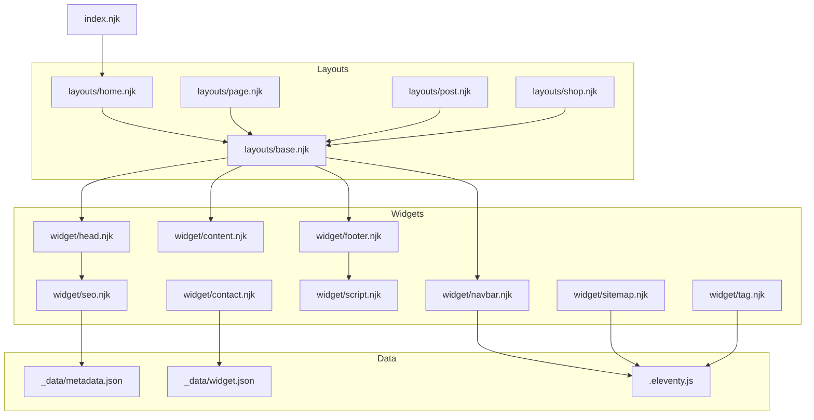
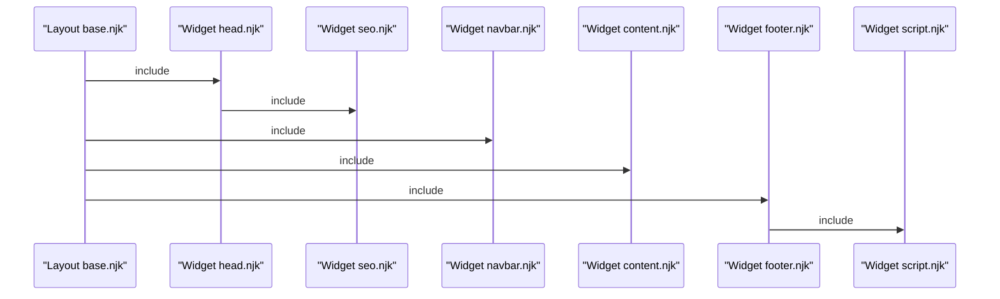
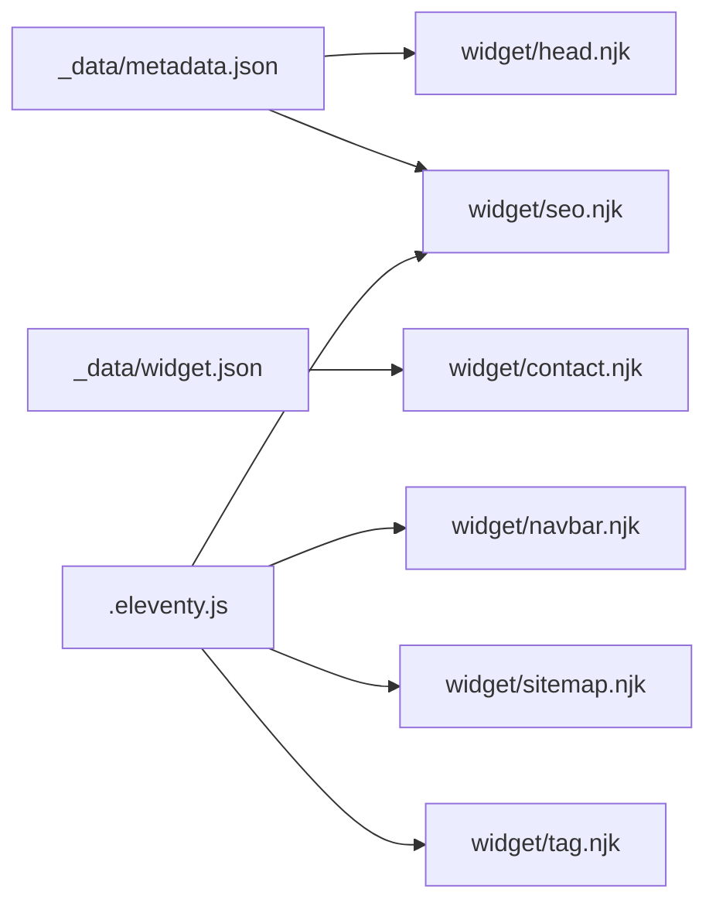

# Widget System

<cite>
**Referenced Files in This Document**
- [head.njk](file://_includes/widget/head.njk)
- [seo.njk](file://_includes/widget/seo.njk)
- [navbar.njk](file://_includes/widget/navbar.njk)
- [content.njk](file://_includes/widget/content.njk)
- [footer.njk](file://_includes/widget/footer.njk)
- [script.njk](file://_includes/widget/script.njk)
- [sitemap.njk](file://_includes/widget/sitemap.njk)
- [tag.njk](file://_includes/widget/tag.njk)
- [contact.njk](file://_includes/widget/contact.njk)
- [base.njk](file://_includes/layouts/base.njk)
- [home.njk](file://_includes/layouts/home.njk)
- [page.njk](file://_includes/layouts/page.njk)
- [post.njk](file://_includes/layouts/post.njk)
- [shop.njk](file://_includes/layouts/shop.njk)
- [index.njk](file://index.njk)
- [.eleventy.js](file://.eleventy.js)
- [metadata.json](file://_data/metadata.json)
- [widget.json](file://_data/widget.json)
</cite>

## Table of Contents
1. [Introduction](#introduction)
2. [Project Structure](#project-structure)
3. [Core Components](#core-components)
4. [Architecture Overview](#architecture-overview)
5. [Detailed Component Analysis](#detailed-component-analysis)
6. [Dependency Analysis](#dependency-analysis)
7. [Performance Considerations](#performance-considerations)
8. [Troubleshooting Guide](#troubleshooting-guide)
9. [Conclusion](#conclusion)
10. [Appendices](#appendices)

## Introduction
This document explains the widget system architecture in Nillianstore2, focusing on how reusable UI components are composed and rendered across pages using Eleventy. Widgets encapsulate common concerns such as head metadata, SEO, navigation, content rendering, footer, scripts, sitemaps, tags, and contact blocks. The system emphasizes modularity, data-driven configuration, and performance-conscious resource loading.

## Project Structure
Widgets live under _includes/widget and are included by layout files to compose full pages. Layouts define page-specific structure while delegating shared behavior to widgets. Data for widgets is provided via global site data and per-page front matter.

**Diagram sources**
- [base.njk:1-4](file://_includes/layouts/base.njk#L1-L4)
- [head.njk:1-113](file://_includes/widget/head.njk#L1-L113)
- [seo.njk:1-208](file://_includes/widget/seo.njk#L1-L208)
- [navbar.njk:1-37](file://_includes/widget/navbar.njk#L1-L37)
- [content.njk:1-1](file://_includes/widget/content.njk#L1-L1)
- [footer.njk:1-52](file://_includes/widget/footer.njk#L1-L52)
- [script.njk:1-3](file://_includes/widget/script.njk#L1-L3)
- [sitemap.njk:1-22](file://_includes/widget/sitemap.njk#L1-L22)
- [tag.njk:1-6](file://_includes/widget/tag.njk#L1-L6)
- [contact.njk:1-8](file://_includes/widget/contact.njk#L1-L8)
- [home.njk:1-5](file://_includes/layouts/home.njk#L1-L5)
- [page.njk:1-10](file://_includes/layouts/page.njk#L1-L10)
- [post.njk:1-6](file://_includes/layouts/post.njk#L1-L6)
- [shop.njk:1-5](file://_includes/layouts/shop.njk#L1-L5)
- [index.njk:1-47](file://index.njk#L1-L47)
- [.eleventy.js:1-160](file://.eleventy.js#L1-L160)
- [metadata.json:1-27](file://_data/metadata.json#L1-L27)
- [widget.json:1-7](file://_data/widget.json#L1-L7)

**Section sources**
- [base.njk:1-4](file://_includes/layouts/base.njk#L1-L4)
- [home.njk:1-5](file://_includes/layouts/home.njk#L1-L5)
- [page.njk:1-10](file://_includes/layouts/page.njk#L1-L10)
- [post.njk:1-6](file://_includes/layouts/post.njk#L1-L6)
- [shop.njk:1-5](file://_includes/layouts/shop.njk#L1-L5)
- [index.njk:1-47](file://index.njk#L1-L47)
- [.eleventy.js:1-160](file://.eleventy.js#L1-L160)
- [metadata.json:1-27](file://_data/metadata.json#L1-L27)
- [widget.json:1-7](file://_data/widget.json#L1-L7)

## Core Components
- head.njk: Defines the HTML <head>, preloads critical CSS/JS, includes SEO widget, sets favicon, feeds, and analytics initialization.
- seo.njk: Generates title, meta descriptions, Open Graph/Twitter cards, canonical URL, robots directive, Google verification, and structured data (Product, Article, Organization/WebSite/BreadcrumbList).
- navbar.njk: Renders responsive navigation with links from Eleventy navigation collection and a client-side search input with results dropdown.
- content.njk: Renders the main page content safely.
- footer.njk: Site footer with branding, navigation links, social icons, and includes script.njk.
- script.njk: Loads Bootstrap JS at the end of the body and closes HTML.
- sitemap.njk: Builds XML sitemap entries for all non-excluded pages with change frequency and priority based on tags.
- tag.njk: Displays a list of items filtered by a given tag using Eleventy collections.
- contact.njk: Contact/help block driven by widget.json configuration.

**Section sources**
- [head.njk:1-113](file://_includes/widget/head.njk#L1-L113)
- [seo.njk:1-208](file://_includes/widget/seo.njk#L1-L208)
- [navbar.njk:1-37](file://_includes/widget/navbar.njk#L1-L37)
- [content.njk:1-1](file://_includes/widget/content.njk#L1-L1)
- [footer.njk:1-52](file://_includes/widget/footer.njk#L1-L52)
- [script.njk:1-3](file://_includes/widget/script.njk#L1-L3)
- [sitemap.njk:1-22](file://_includes/widget/sitemap.njk#L1-L22)
- [tag.njk:1-6](file://_includes/widget/tag.njk#L1-L6)
- [contact.njk:1-8](file://_includes/widget/contact.njk#L1-L8)

## Architecture Overview
The base layout composes the core widgets in order: head, navbar, content, footer. The head widget includes SEO and initializes deferred resources. Footer includes script.njk to close the document. Page layouts extend base and inject page-specific content sections.

**Diagram sources**
- [base.njk:1-4](file://_includes/layouts/base.njk#L1-L4)
- [head.njk:42-42](file://_includes/widget/head.njk#L42-L42)
- [seo.njk:1-208](file://_includes/widget/seo.njk#L1-L208)
- [navbar.njk:1-37](file://_includes/widget/navbar.njk#L1-L37)
- [content.njk:1-1](file://_includes/widget/content.njk#L1-L1)
- [footer.njk:1-52](file://_includes/widget/footer.njk#L1-L52)
- [script.njk:1-3](file://_includes/widget/script.njk#L1-L3)

## Detailed Component Analysis

### Head Widget (head.njk)
Responsibilities:
- Define doctype, html lang, viewport, theme color, mobile app capabilities.
- Preload Swiper CSS; defer Swiper JS until DOMContentLoaded and initialize only if needed.
- Include SEO widget for dynamic metadata.
- Set generator, developer, favicon, and preload critical CSS with noscript fallbacks.
- Register feed alternates and CDN prefetch/preconnect hints.
- Inline hero image styles.
- Initialize Google Analytics gtag asynchronously.
- Defer EmbedSocial script conditionally.

Key behaviors:
- Resource prioritization via preload and async/defer patterns.
- Conditional script injection to avoid unnecessary work.

**Section sources**
- [head.njk:1-113](file://_includes/widget/head.njk#L1-L113)

### SEO Widget (seo.njk)
Responsibilities:
- Title and description with fallbacks to metadata.
- Open Graph and Twitter card fields.
- Dynamic og:type based on tags (product/article/website).
- Canonical link and robots directive.
- Google site verification meta.
- Structured data:
  - Product schema when tagged as shop.
  - Article schema when tagged as post/blog.
  - Organization and WebSite schemas on homepage.
  - BreadcrumbList schema for non-home pages with conditional hierarchy.

Data dependencies:
- Front-matter variables: title, description, cover, tags, ecwidId, price, category.
- Global data: metadata, site.url.
- Filters: sanitize, isoDateTime, htmlDateString, safeSlug.

**Section sources**
- [seo.njk:1-208](file://_includes/widget/seo.njk#L1-L208)
- [.eleventy.js:25-70](file://.eleventy.js#L25-L70)
- [metadata.json:1-27](file://_data/metadata.json#L1-L27)

### Navbar Widget (navbar.njk)
Responsibilities:
- Render brand logo and shop name from metadata.
- Build navigation links from Eleventy navigation collection.
- Provide a search input with an absolute-positioned results dropdown.

Integration:
- Uses eleventyNavigation filter over collections.all.
- Client-side search logic is implemented in base layout script.

**Section sources**
- [navbar.njk:1-37](file://_includes/widget/navbar.njk#L1-L37)
- [base.njk:6-61](file://_includes/layouts/base.njk#L6-L61)
- [.eleventy.js:1-160](file://.eleventy.js#L1-L160)

### Content Widget (content.njk)
Responsibilities:
- Render page content safely.

Usage:
- Included by base layout to display page-specific markup.

**Section sources**
- [content.njk:1-1](file://_includes/widget/content.njk#L1-L1)
- [base.njk:1-4](file://_includes/layouts/base.njk#L1-L4)

### Footer Widget (footer.njk)
Responsibilities:
- Branding and tagline.
- Navigation links from Eleventy navigation collection.
- Social media and Amazon storefront links.
- Includes script.njk to load Bootstrap JS and close HTML.

**Section sources**
- [footer.njk:1-52](file://_includes/widget/footer.njk#L1-L52)
- [script.njk:1-3](file://_includes/widget/script.njk#L1-L3)

### Script Widget (script.njk)
Responsibilities:
- Load Bootstrap bundle with integrity and defer.
- Close body and html tags.

**Section sources**
- [script.njk:1-3](file://_includes/widget/script.njk#L1-L3)

### Sitemap Widget (sitemap.njk)
Responsibilities:
- Iterate collections.all and emit <url> entries.
- Exclude excluded pages and specific paths.
- Assign changefreq and priority based on page type (homepage, posts/shops, others).

Data dependencies:
- collections.all, page.data.tags, page.date, site.url.

**Section sources**
- [sitemap.njk:1-22](file://_includes/widget/sitemap.njk#L1-L22)
- [.eleventy.js:1-160](file://.eleventy.js#L1-L160)

### Tag Widget (tag.njk)
Responsibilities:
- Display a heading for the current tag.
- Retrieve the collection for the tag and render a posts list.
- Provide a link to explore all tags.

Integration:
- Relies on Eleventy collections keyed by sanitized tag slugs.

**Section sources**
- [tag.njk:1-6](file://_includes/widget/tag.njk#L1-L6)
- [.eleventy.js:72-95](file://.eleventy.js#L72-L95)

### Contact Widget (contact.njk)
Responsibilities:
- Show help text and call-to-action button.
- Pull configuration from widget.json.

**Section sources**
- [contact.njk:1-8](file://_includes/widget/contact.njk#L1-L8)
- [widget.json:1-7](file://_data/widget.json#L1-L7)

### Layout Composition
- base.njk includes head, navbar, content, footer.
- home.njk, page.njk, post.njk, shop.njk extend base and inject page-specific sections.
- index.njk demonstrates a concrete page using home layout and including design-specific partials.

**Section sources**
- [base.njk:1-4](file://_includes/layouts/base.njk#L1-L4)
- [home.njk:1-5](file://_includes/layouts/home.njk#L1-L5)
- [page.njk:1-10](file://_includes/layouts/page.njk#L1-L10)
- [post.njk:1-6](file://_includes/layouts/post.njk#L1-L6)
- [shop.njk:1-5](file://_includes/layouts/shop.njk#L1-L5)
- [index.njk:1-47](file://index.njk#L1-L47)

## Dependency Analysis
- Data flow:
  - metadata.json provides global site info used by head and seo widgets.
  - widget.json configures contact widget.
  - .eleventy.js defines filters (sanitize, isoDateTime, htmlDateString, safeSlug), adds navigation plugin, and creates tagList collection.
- Collections:
  - eleventyNavigation powers navbar and footer links.
  - collections.all drives sitemap generation.
  - Tag-based collections drive tag.njk listing.

**Diagram sources**
- [metadata.json:1-27](file://_data/metadata.json#L1-L27)
- [widget.json:1-7](file://_data/widget.json#L1-L7)
- [.eleventy.js:1-160](file://.eleventy.js#L1-L160)
- [head.njk:1-113](file://_includes/widget/head.njk#L1-L113)
- [seo.njk:1-208](file://_includes/widget/seo.njk#L1-L208)
- [navbar.njk:1-37](file://_includes/widget/navbar.njk#L1-L37)
- [sitemap.njk:1-22](file://_includes/widget/sitemap.njk#L1-L22)
- [tag.njk:1-6](file://_includes/widget/tag.njk#L1-L6)
- [contact.njk:1-8](file://_includes/widget/contact.njk#L1-L8)

**Section sources**
- [.eleventy.js:1-160](file://.eleventy.js#L1-L160)
- [metadata.json:1-27](file://_data/metadata.json#L1-L27)
- [widget.json:1-7](file://_data/widget.json#L1-L7)

## Performance Considerations
- Critical CSS preloading and noscript fallbacks reduce FOUC and improve perceived performance.
- Deferred third-party libraries (Swiper, Bootstrap) minimize render-blocking.
- Conditional script injection avoids unnecessary execution.
- Async analytics initialization prevents blocking.
- Use of CDN prefetch/preconnect improves resource fetch times.
- Lazy-loading images where appropriate reduces initial payload.

[No sources needed since this section provides general guidance]

## Troubleshooting Guide
- Missing or incorrect metadata:
  - Ensure metadata.json contains required keys (title, description, url, icon, author).
  - Verify page-level overrides (title, description, cover) are present for SEO widget.
- Navigation not showing:
  - Confirm eleventyNavigation front matter exists on pages and that @11ty/eleventy-navigation plugin is enabled.
- Search not working:
  - Ensure /products.json is generated and accessible; verify client-side script in base layout runs after DOMContentLoaded.
- Sitemap missing entries:
  - Check page exclusion flags and ensure collections.all is populated during build.
- Tag pages empty:
  - Validate tag names and slug normalization; confirm tagList collection and safeSlug usage align with permalinks.

**Section sources**
- [metadata.json:1-27](file://_data/metadata.json#L1-L27)
- [base.njk:6-61](file://_includes/layouts/base.njk#L6-L61)
- [sitemap.njk:1-22](file://_includes/widget/sitemap.njk#L1-L22)
- [.eleventy.js:72-95](file://.eleventy.js#L72-L95)

## Conclusion
The widget system in Nillianstore2 cleanly separates cross-cutting concerns into reusable components, orchestrated by layouts and powered by Eleventy’s data and collection features. By leveraging preloading, deferral, and conditional execution, the system balances maintainability with performance. Extending the system involves adding new widgets and composing them within layouts, while keeping data sources centralized and consistent.

[No sources needed since this section summarizes without analyzing specific files]

## Appendices

### Widget Composition Patterns
- Include pattern: Layouts include widgets in a fixed order to guarantee correct rendering sequence.
- Data passing:
  - Global data via metadata.json and site.url.
  - Per-page front matter variables override defaults in SEO widget.
  - Collection-driven data for navigation and tag listings.
- Reusability:
  - Widgets remain independent of page context except for explicit data expectations.

**Section sources**
- [base.njk:1-4](file://_includes/layouts/base.njk#L1-L4)
- [seo.njk:1-208](file://_includes/widget/seo.njk#L1-L208)
- [navbar.njk:1-37](file://_includes/widget/navbar.njk#L1-L37)
- [tag.njk:1-6](file://_includes/widget/tag.njk#L1-L6)

### Creating Custom Widgets
Steps:
1. Create a new file under _includes/widget/<name>.njk.
2. Reference global data (metadata, site.url) and any per-page front matter variables.
3. Compose the widget in a layout or another widget via .
4. If it depends on collections, use Eleventy’s collection API and filters defined in .eleventy.js.
5. Test locally and verify output in the browser and source.

Best practices:
- Keep widgets focused on a single responsibility.
- Prefer data-driven configuration over hard-coded values.
- Use filters for sanitization and formatting.
- Avoid heavy synchronous operations; defer non-critical scripts.

**Section sources**
- [.eleventy.js:25-70](file://.eleventy.js#L25-L70)
- [base.njk:1-4](file://_includes/layouts/base.njk#L1-L4)

### Integration with Eleventy Collections
- Navigation: eleventyNavigation over collections.all renders links in navbar and footer.
- Sitemap: Iterates collections.all to generate URLs with change frequency and priority.
- Tags: Uses tag-based collections and safeSlug to match permalinks.

**Section sources**
- [navbar.njk:11-14](file://_includes/widget/navbar.njk#L11-L14)
- [footer.njk:15-23](file://_includes/widget/footer.njk#L15-L23)
- [sitemap.njk:3-21](file://_includes/widget/sitemap.njk#L3-L21)
- [tag.njk:1-6](file://_includes/widget/tag.njk#L1-L6)
- [.eleventy.js:72-95](file://.eleventy.js#L72-L95)

### Configuration Options Summary
- metadata.json:
  - title, description, url, shopname, banner, language, locale, tweet, icon, feed, jsonfeed, author.
- widget.json:
  - help, helpinfo, helpbtn, helplink.
- Page front matter (examples):
  - title, description, cover, tags, ecwidId, price, category.

**Section sources**
- [metadata.json:1-27](file://_data/metadata.json#L1-L27)
- [widget.json:1-7](file://_data/widget.json#L1-L7)
- [seo.njk:1-208](file://_includes/widget/seo.njk#L1-L208)