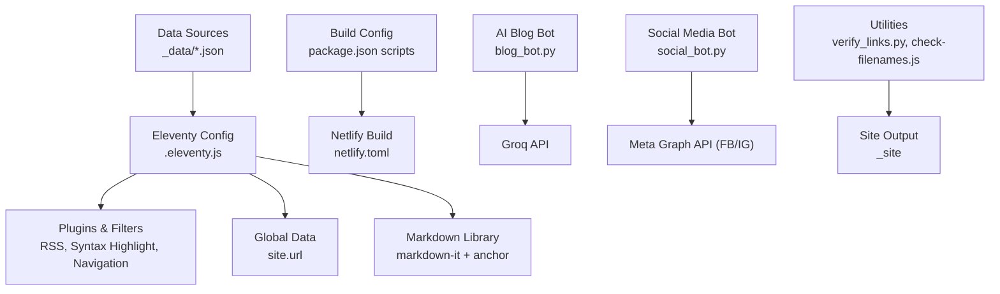
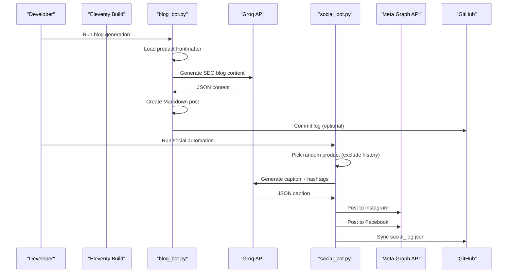
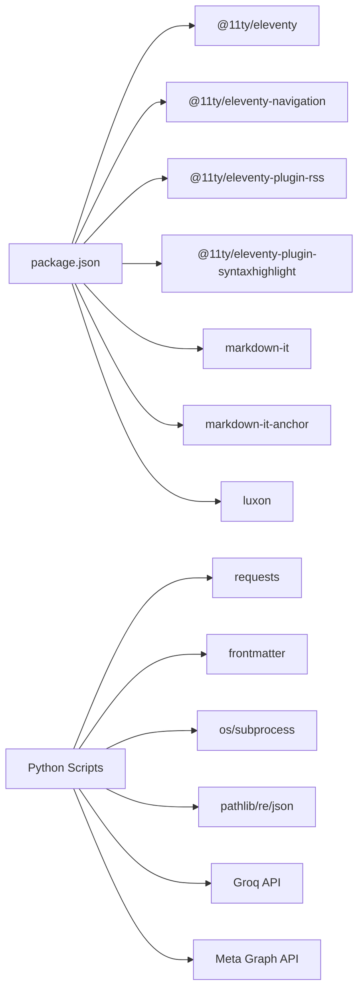

# Troubleshooting and FAQ

<cite>
**Referenced Files in This Document**
- [README.md](file://README.md)
- [SOCIAL_BOT_SETUP.md](file://SOCIAL_BOT_SETUP.md)
- [package.json](file://package.json)
- [netlify.toml](file://netlify.toml)
- [.eleventy.js](file://.eleventy.js)
- [blog_bot.py](file://blog_bot.py)
- [social_bot.py](file://social_bot.py)
- [test_frontmatter.py](file://test_frontmatter.py)
- [verify_links.py](file://verify_links.py)
- [scripts/check-filenames.js](file://scripts/check-filenames.js)
- [_data/metadata.json](file://_data/metadata.json)
- [blog_log.json](file://blog_log.json)
</cite>

## Table of Contents
1. Introduction
2. Project Structure
3. Core Components
4. Architecture Overview
5. Detailed Component Analysis
6. Dependency Analysis
7. Performance Considerations
8. Troubleshooting Guide
9. Conclusion
10. Appendices

## Introduction
This document provides comprehensive troubleshooting guidance for the Nillianstore2 platform, focusing on setup issues (API configuration, dependency conflicts, build errors), AI service integration problems, social media posting failures, content generation issues, performance optimization, memory management, scaling considerations, deployment to Netlify, environment variable pitfalls, production troubleshooting, debugging Python automation scripts, template rendering issues, data processing errors, and frequently asked questions with step-by-step solutions.

The platform is an Eleventy-based static site generator integrated with:
- AI-powered content generation via Groq API
- Social media automation (Instagram/Facebook) using Meta APIs
- Automated blog post creation from product data
- Build-time checks and Netlify deployment configuration

## Project Structure
Key directories and files relevant to troubleshooting:
- Site configuration and Eleventy plugins: .eleventy.js, package.json, netlify.toml
- Data sources: _data/*.json
- Automation scripts: blog_bot.py, social_bot.py, test_frontmatter.py, verify_links.py
- Build-time utilities: scripts/check-filenames.js
- Logs: blog_log.json

**Diagram sources**
- [.eleventy.js:1-160](file://.eleventy.js#L1-L160)
- [package.json:1-34](file://package.json#L1-L34)
- [netlify.toml:1-3](file://netlify.toml#L1-L3)
- [blog_bot.py:1-253](file://blog_bot.py#L1-L253)
- [social_bot.py:1-315](file://social_bot.py#L1-L315)
- [verify_links.py:1-55](file://verify_links.py#L1-L55)
- [scripts/check-filenames.js:1-45](file://scripts/check-filenames.js#L1-L45)
- [_data/metadata.json:1-27](file://_data/metadata.json#L1-L27)

**Section sources**
- [.eleventy.js:1-160](file://.eleventy.js#L1-L160)
- [package.json:1-34](file://package.json#L1-L34)
- [netlify.toml:1-3](file://netlify.toml#L1-L3)
- [_data/metadata.json:1-27](file://_data/metadata.json#L1-L27)

## Core Components
- Eleventy configuration and filters:
  - Adds RSS, syntax highlighting, navigation plugins
  - Defines global site URL and deep merge behavior
  - Provides date formatting, safe slug generation, tag filtering, XML encoding
  - Configures markdown-it with anchor links
  - Sets up BrowserSync middleware for local development
- Build and deployment:
  - npm scripts for build, watch, serve, debug
  - Netlify publish directory and build command
- AI-driven blog generation:
  - Reads product frontmatter, calls Groq API, writes Markdown posts
  - Maintains history to avoid repetition
- Social media automation:
  - Selects products, generates captions via Groq, posts to Instagram and Facebook
  - Syncs logs back to GitHub when token is available
- Utilities:
  - Frontmatter validation helper
  - Link verification across shop and posts
  - Filename safety checker for generated output

**Section sources**
- [.eleventy.js:10-143](file://.eleventy.js#L10-L143)
- [package.json:5-12](file://package.json#L5-L12)
- [netlify.toml:1-3](file://netlify.toml#L1-L3)
- [blog_bot.py:18-208](file://blog_bot.py#L18-L208)
- [social_bot.py:62-311](file://social_bot.py#L62-L311)
- [test_frontmatter.py:1-17](file://test_frontmatter.py#L1-L17)
- [verify_links.py:1-55](file://verify_links.py#L1-L55)
- [scripts/check-filenames.js:1-45](file://scripts/check-filenames.js#L1-L45)

## Architecture Overview
High-level flow for content generation and social posting:

**Diagram sources**
- [blog_bot.py:48-208](file://blog_bot.py#L48-L208)
- [social_bot.py:120-311](file://social_bot.py#L120-L311)

## Detailed Component Analysis

### Eleventy Configuration and Filters
- Plugins: RSS, syntax highlight, navigation are added at startup.
- Global data: site.url is set for absolute URLs and sitemaps.
- Filters:
  - readableDate, htmlDateString, isoDateTime format dates consistently.
  - head, min provide array/math helpers.
  - safeSlug normalizes tags to safe filenames for Netlify compatibility.
  - filterTagList excludes internal tags.
  - sanitize escapes quotes and newlines for safe frontmatter.
  - xmlEncode ensures valid XML output.
- Markdown library: markdown-it configured with HTML, breaks, linkify; anchor plugin enabled.
- BrowserSync: injects a custom 404 handler during local dev.
- Directory structure: input, includes, data, output paths defined.

Common issues and fixes:
- Incorrect site.url or pathPrefix can break absolute links and feeds.
- Missing plugins cause build errors; ensure versions match package.json.
- Custom filters referencing missing Eleventy filters will fail; safeSlug depends on built-in slug filter.

**Section sources**
- [.eleventy.js:10-143](file://.eleventy.js#L10-L143)
- [.eleventy.js:146-159](file://.eleventy.js#L146-L159)

### Build and Deployment (Netlify)
- Build command runs Eleventy with DEBUG=* for verbose logs.
- Publish directory is _site.
- Local scripts include watch, serve, debug modes.

Common issues and fixes:
- Build fails due to Node version mismatch; align with project requirements.
- Missing dependencies; run npm install before build.
- Netlify environment variables not set; configure in Netlify UI under Environment Variables.

**Section sources**
- [package.json:5-12](file://package.json#L5-L12)
- [netlify.toml:1-3](file://netlify.toml#L1-L3)

### AI Blog Generation (blog_bot.py)
Workflow:
- Loads product frontmatter from shop directory.
- Calls Groq API with structured prompt to generate SEO content.
- Creates a Markdown file in posts directory with sanitized frontmatter and content.
- Updates blog_log.json to avoid repeating products.

Common issues and fixes:
- Missing GROQ_API_KEY: script exits early; set environment variable.
- Invalid product frontmatter: ensure required fields exist (title, images, cover).
- Network errors from Groq API: check connectivity and rate limits.
- File naming conflicts: safe slug generation helps; verify uniqueness.

**Section sources**
- [blog_bot.py:18-208](file://blog_bot.py#L18-L208)
- [blog_log.json:1-1](file://blog_log.json#L1-L1)

### Social Media Automation (social_bot.py)
Workflow:
- Validates required secrets (GROQ_API_KEY, META_ACCESS_TOKEN, FB_PAGE_ID, IG_USER_ID).
- Picks a random product excluding previously posted IDs.
- Generates caption and hashtags via Groq.
- Posts to Instagram (single image or carousel) and Facebook.
- Syncs social_log.json to GitHub if GITHUB_TOKEN is present.

Common issues and fixes:
- Missing secrets: script prints error and exits; add repository secrets per guide.
- Expired access tokens: error code 190 indicates expiration; regenerate long-lived token.
- No images found: skip product and try next; ensure cover/images fields exist.
- API rate limits or network errors: retry logic included; monitor logs.

**Section sources**
- [social_bot.py:248-311](file://social_bot.py#L248-L311)
- [SOCIAL_BOT_SETUP.md:1-106](file://SOCIAL_BOT_SETUP.md#L1-L106)

### Utilities and Validation
- test_frontmatter.py: quick check for specific product frontmatter fields.
- verify_links.py: cross-check Amazon links between shop and posts.
- scripts/check-filenames.js: scan _site for forbidden characters (?#) in filenames.

Common issues and fixes:
- Inconsistent link fields (link vs amazonLink): use verify_links.py to detect mismatches.
- Forbidden filename characters: run filename check after build; fix safeSlug usage.

**Section sources**
- [test_frontmatter.py:1-17](file://test_frontmatter.py#L1-L17)
- [verify_links.py:1-55](file://verify_links.py#L1-L55)
- [scripts/check-filenames.js:1-45](file://scripts/check-filenames.js#L1-L45)

## Dependency Analysis
External dependencies and integrations:
- Eleventy core and plugins: @11ty/eleventy, @11ty/eleventy-navigation, @11ty/eleventy-plugin-rss, @11ty/eleventy-plugin-syntaxhighlight
- Markdown processing: markdown-it, markdown-it-anchor
- Date/time: luxon
- Python libraries: requests, frontmatter, pathlib, re, json, os, subprocess, time, sys
- External APIs: Groq API, Meta Graph API (Facebook/Instagram)

Potential conflicts:
- Version mismatches in Eleventy plugins can cause build failures.
- Python environment lacking required packages leads to import errors.
- Network restrictions blocking API calls.

**Diagram sources**
- [package.json:24-32](file://package.json#L24-L32)
- [blog_bot.py:1-9](file://blog_bot.py#L1-L9)
- [social_bot.py:1-10](file://social_bot.py#L1-L10)

**Section sources**
- [package.json:24-32](file://package.json#L24-L32)
- [blog_bot.py:1-9](file://blog_bot.py#L1-L9)
- [social_bot.py:1-10](file://social_bot.py#L1-L10)

## Performance Considerations
- Build performance:
  - Use eleventy --watch for incremental builds during development.
  - Keep assets minimal; leverage passthrough copy for img/css/videos.
- Memory management:
  - Avoid loading large datasets into memory; iterate over files lazily.
  - Limit number of images processed per post (script caps at 3).
- Scaling considerations:
  - For large product catalogs, consider batching API calls and caching responses.
  - Use retries and exponential backoff for external API calls.
- Debugging:
  - Enable DEBUG=* locally and in Netlify to capture detailed logs.

[No sources needed since this section provides general guidance]

## Troubleshooting Guide

### Setup Issues

#### API Configuration Problems
- Symptoms:
  - Blog bot exits with “Missing GROQ_API_KEY.”
  - Social bot prints “ERROR: Missing required secrets...”
- Solutions:
  - Set GROQ_API_KEY in your environment or CI secrets.
  - Add required secrets per SOCIAL_BOT_SETUP.md: GROQ_API_KEY, META_ACCESS_TOKEN, FB_PAGE_ID, IG_USER_ID.
  - Verify secret names and values exactly match expected keys.

**Section sources**
- [blog_bot.py:210-213](file://blog_bot.py#L210-L213)
- [social_bot.py:248-263](file://social_bot.py#L248-L263)
- [SOCIAL_BOT_SETUP.md:10-48](file://SOCIAL_BOT_SETUP.md#L10-L48)

#### Dependency Conflicts
- Symptoms:
  - Build fails due to incompatible plugin versions.
  - Import errors in Python scripts.
- Solutions:
  - Align Node.js version with project requirements; reinstall dependencies.
  - Ensure Python environment has requests and frontmatter installed.
  - Check package.json devDependencies for exact versions.

**Section sources**
- [package.json:24-32](file://package.json#L24-L32)
- [blog_bot.py:1-9](file://blog_bot.py#L1-L9)
- [social_bot.py:1-10](file://social_bot.py#L1-L10)

#### Build Errors
- Symptoms:
  - Eleventy build crashes or outputs unexpected filenames.
  - Netlify deploy fails due to forbidden characters in filenames.
- Solutions:
  - Run npm run build locally to reproduce and inspect logs.
  - Use scripts/check-filenames.js to detect problematic filenames in _site.
  - Fix safeSlug usage in templates/filters to sanitize tags properly.

**Section sources**
- [package.json:5-12](file://package.json#L5-L12)
- [scripts/check-filenames.js:22-44](file://scripts/check-filenames.js#L22-L44)
- [.eleventy.js:48-62](file://.eleventy.js#L48-L62)

### AI Service Integration Issues

#### Groq API Failures
- Symptoms:
  - Network errors or invalid response formats from Groq.
  - Content generation returns malformed JSON.
- Solutions:
  - Validate GROQ_API_KEY and model name used in requests.
  - Inspect response text for error details; adjust prompts to enforce JSON output.
  - Implement retry logic with backoff for transient failures.

**Section sources**
- [blog_bot.py:84-97](file://blog_bot.py#L84-L97)
- [social_bot.py:120-136](file://social_bot.py#L120-L136)

#### Content Generation Problems
- Symptoms:
  - Generated blog posts lack required sections or tags.
  - Tags contain unsafe characters causing permalink issues.
- Solutions:
  - Sanitize tags using provided helpers; limit tag count.
  - Enforce structured prompt to return consistent JSON schema.
  - Validate output before writing files.

**Section sources**
- [blog_bot.py:105-123](file://blog_bot.py#L105-L123)
- [blog_bot.py:151-172](file://blog_bot.py#L151-L172)

### Social Media Posting Failures

#### Instagram/Facebook Errors
- Symptoms:
  - Error code 190 indicating expired access token.
  - No images posted or carousel items failing.
- Solutions:
  - Regenerate long-lived META_ACCESS_TOKEN and update secrets.
  - Ensure cover/images fields exist and are accessible URLs.
  - Review API response bodies for detailed error messages.

**Section sources**
- [social_bot.py:186-206](file://social_bot.py#L186-L206)
- [social_bot.py:226-246](file://social_bot.py#L226-L246)
- [SOCIAL_BOT_SETUP.md:75-99](file://SOCIAL_BOT_SETUP.md#L75-L99)

#### No Posts Happening
- Symptoms:
  - Workflow does not trigger or skips all products.
- Solutions:
  - Manually trigger workflow from Actions tab.
  - Confirm /shop/ contains valid product markdown files.
  - Check social_log.json for repeated selections; reset if necessary.

**Section sources**
- [SOCIAL_BOT_SETUP.md:87-91](file://SOCIAL_BOT_SETUP.md#L87-L91)
- [social_bot.py:79-94](file://social_bot.py#L79-L94)

### Data Processing Errors

#### Frontmatter Validation
- Symptoms:
  - Missing or inconsistent fields like link/amazonLink/permalink.
- Solutions:
  - Use test_frontmatter.py to validate sample products.
  - Standardize frontmatter schema across shop files.

**Section sources**
- [test_frontmatter.py:1-17](file://test_frontmatter.py#L1-L17)

#### Link Verification
- Symptoms:
  - Mismatched Amazon links between shop and generated posts.
- Solutions:
  - Run verify_links.py to identify discrepancies.
  - Update shop frontmatter or regenerate posts to align links.

**Section sources**
- [verify_links.py:1-55](file://verify_links.py#L1-L55)

### Template Rendering Issues

#### Date Formatting and Timezones
- Symptoms:
  - Dates displayed incorrectly or timezone mismatches.
- Solutions:
  - Use provided filters (readableDate, htmlDateString, isoDateTime) which handle UTC and Asia/Dubai zones.
  - Ensure input dates are valid JS Date objects.

**Section sources**
- [.eleventy.js:26-37](file://.eleventy.js#L26-L37)

#### Safe Permalinks and Slugs
- Symptoms:
  - Filenames with special characters causing Netlify routing issues.
- Solutions:
  - Apply safeSlug filter to normalize tags and slugs.
  - Run filename checker post-build to catch violations.

**Section sources**
- [.eleventy.js:48-62](file://.eleventy.js#L48-L62)
- [scripts/check-filenames.js:22-44](file://scripts/check-filenames.js#L22-L44)

### Deployment Issues (Netlify)

#### Environment Variables
- Symptoms:
  - Build succeeds locally but fails on Netlify due to missing variables.
- Solutions:
  - Configure environment variables in Netlify UI under Environment Variables.
  - Match variable names exactly with those used in scripts/config.

**Section sources**
- [netlify.toml:1-3](file://netlify.toml#L1-L3)

#### Production Troubleshooting
- Symptoms:
  - 404 pages not served correctly in production.
- Solutions:
  - Ensure proper 404.html exists and is published.
  - Use BrowserSync middleware only for local development; rely on platform’s 404 handling in production.

**Section sources**
- [.eleventy.js:118-132](file://.eleventy.js#L118-L132)

### Debugging Approaches

#### Python Automation Scripts
- Steps:
  - Print intermediate variables and API payloads.
  - Capture exceptions and response bodies for diagnostics.
  - Use logging instead of print statements for structured output.

**Section sources**
- [blog_bot.py:248-252](file://blog_bot.py#L248-L252)
- [social_bot.py:302-309](file://social_bot.py#L302-L309)

#### Eleventy Debugging
- Steps:
  - Run with DEBUG=* to enable verbose logs.
  - Inspect collections and filters for correctness.
  - Validate markdown-it configuration and anchor links.

**Section sources**
- [package.json:10](file://package.json#L10)
- [.eleventy.js:106-116](file://.eleventy.js#L106-L116)

## Frequently Asked Questions

- Q: Why does the blog bot stop generating posts?
  - A: Check GROQ_API_KEY availability and product frontmatter completeness. Review blog_log.json for repeated selections.

- Q: How do I refresh social media tokens?
  - A: Regenerate a long-lived META_ACCESS_TOKEN and update repository secrets.

- Q: What should I do if Netlify build fails due to filenames?
  - A: Run scripts/check-filenames.js after build and fix safeSlug usage in templates/filters.

- Q: How can I verify Amazon links in posts?
  - A: Execute verify_links.py to detect mismatches between shop and posts.

- Q: Why are dates showing incorrect timezones?
  - A: Use provided date filters that handle UTC and Asia/Dubai zones appropriately.

- Q: How do I enable detailed logs for Eleventy?
  - A: Use npm run debug or set DEBUG=* in build commands.

**Section sources**
- [blog_bot.py:210-213](file://blog_bot.py#L210-L213)
- [social_bot.py:248-263](file://social_bot.py#L248-L263)
- [scripts/check-filenames.js:22-44](file://scripts/check-filenames.js#L22-L44)
- [verify_links.py:1-55](file://verify_links.py#L1-L55)
- [.eleventy.js:26-37](file://.eleventy.js#L26-L37)
- [package.json:10](file://package.json#L10)

## Conclusion
This troubleshooting guide consolidates common issues and resolutions across setup, AI integration, social automation, build/deployment, and data processing. By following the steps outlined and leveraging provided utilities, you can diagnose and resolve most problems efficiently. For ongoing maintenance, keep dependencies updated, validate frontmatter schemas, and monitor API credentials and logs.

[No sources needed since this section summarizes without analyzing specific files]

## Appendices

### Quick Reference: Required Secrets and Variables
- GROQ_API_KEY: Used by both blog and social bots for content generation.
- META_ACCESS_TOKEN: Required for Facebook/Instagram posting.
- FB_PAGE_ID: Identifies Facebook Page for posting.
- IG_USER_ID: Identifies Instagram Business Account for posting.
- GITHUB_TOKEN: Optional; enables syncing logs back to repository.

**Section sources**
- [SOCIAL_BOT_SETUP.md:10-48](file://SOCIAL_BOT_SETUP.md#L10-L48)
- [social_bot.py:16-21](file://social_bot.py#L16-L21)

### Build Commands and Scripts
- npm run build: Generate static site.
- npm run watch: Incremental build for development.
- npm run serve: Start local server.
- npm run debug: Run Eleventy with DEBUG=*.
- npm run check:filenames: Validate output filenames.

**Section sources**
- [package.json:5-12](file://package.json#L5-L12)